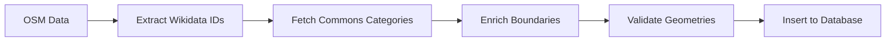

# Import System Documentation

Complete documentation for the geocode-commons-categories data import pipeline.

## Overview

The import system is a multi-stage pipeline that:
1. Fetches administrative boundary data from OpenStreetMap via the Overpass API
2. Enriches the data with Wikimedia Commons categories via Wikidata
3. Transforms and validates the data for PostgreSQL/PostGIS
4. Batch inserts the data with transaction safety

## Documentation Structure

- **[Architecture](./architecture.md)** - High-level system architecture, component relationships, and configuration
- **[Data Flow](./data-flow.md)** - Complete data flow diagrams, sequence diagrams, and state transitions
- **[API Interactions](./api-interactions.md)** - External API integration details (Overpass, Wikidata)
- **[Error Handling](./error-handling.md)** - Retry logic, error recovery, and failure handling

## Quick Start

```bash
# Set required environment variables
export COUNTRY_CODE="US"
export ADMIN_LEVELS="4,6,8"

# Run the full import pipeline
bun import:data

# Or run individual stages
bun import:osm        # Fetch OSM data only
bun import:database   # Insert to database only (requires INPUT_FILE)
```

## Key Concepts

### Effect TS Integration

The import system uses **Effect TS** for predictable error handling:
- All async operations return `Effect.Effect<T, E>`
- Automatic error propagation and recovery
- Resource cleanup guarantees with `Effect.ensuring()`
- Typed error handling with `_tag` discriminators

### Batch Processing

Two levels of batch processing:
- **Wikidata API**: 50 IDs per request with 100ms delays
- **Database**: 1000 records per transaction

### Data Enrichment Pipeline



## Environment Variables

| Variable | Required | Default | Description |
|----------|----------|---------|-------------|
| `COUNTRY_CODE` | Yes | - | ISO 3166-1 alpha-2 country code |
| `ADMIN_LEVELS` | No | "4,6,8" | Comma-separated admin levels |
| `BATCH_SIZE` | No | 1000 | Database batch size |
| `OUTPUT_DIR` | No | "./output" | Intermediate file output directory |
| `DATABASE_URL` | Yes | - | PostgreSQL connection string |
| `SKIP_WIKIDATA` | No | false | Skip Wikidata enrichment stage |
| `INPUT_FILE` | No* | - | JSON file for database-only import (required for `bun import:database`) |

## Performance Characteristics

- **Overpass API**: Single large query, ~1-30 seconds depending on country size
- **Wikidata API**: 50 IDs per request, 100ms delay between batches
- **Database Insert**: 1000 records per transaction
- **Typical Import Time**: 2-10 minutes for medium-sized countries

## Data Validation

The import system validates:
- ✅ All boundaries have valid geometries (PostGIS `ST_IsValid`)
- ✅ Wikidata IDs are properly formatted (Q\d+)
- ✅ Commons categories are extracted from P373 property
- ✅ No duplicate wikidata_id entries
- ✅ admin_level values are within expected range

## Troubleshooting

See individual documentation sections for:
- API rate limiting issues → [API Interactions](./api-interactions.md)
- Database connection problems → [Architecture](./architecture.md)
- Data validation failures → [Data Flow](./data-flow.md)
- Retry mechanism details → [Error Handling](./error-handling.md)
