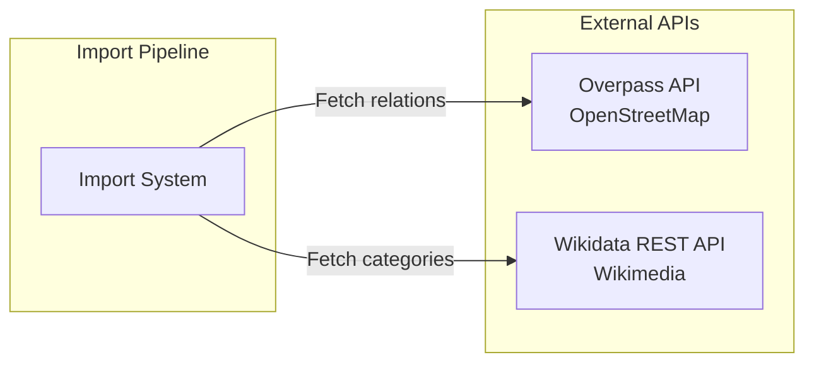
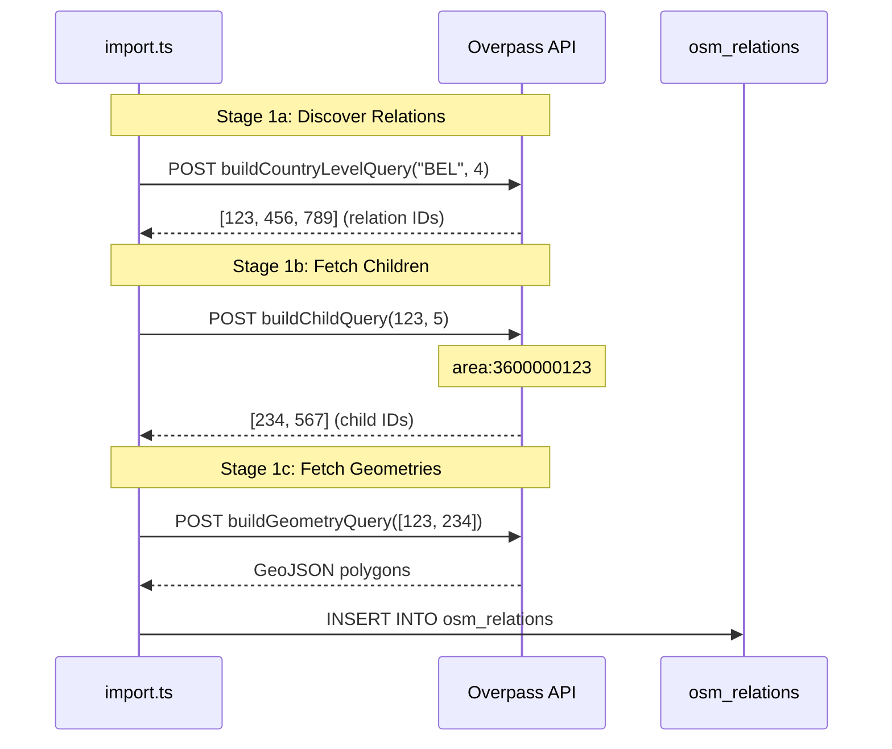
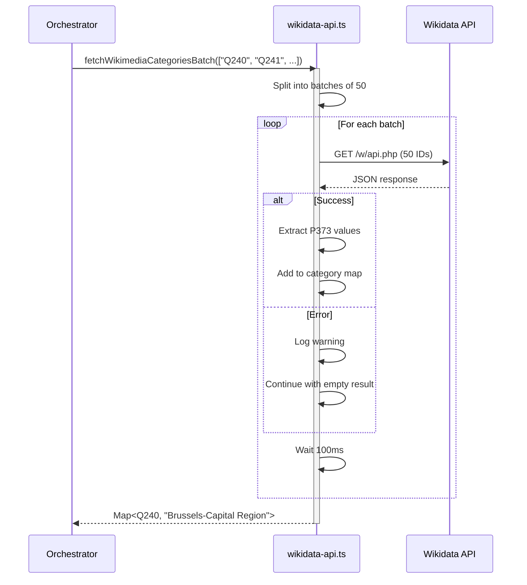
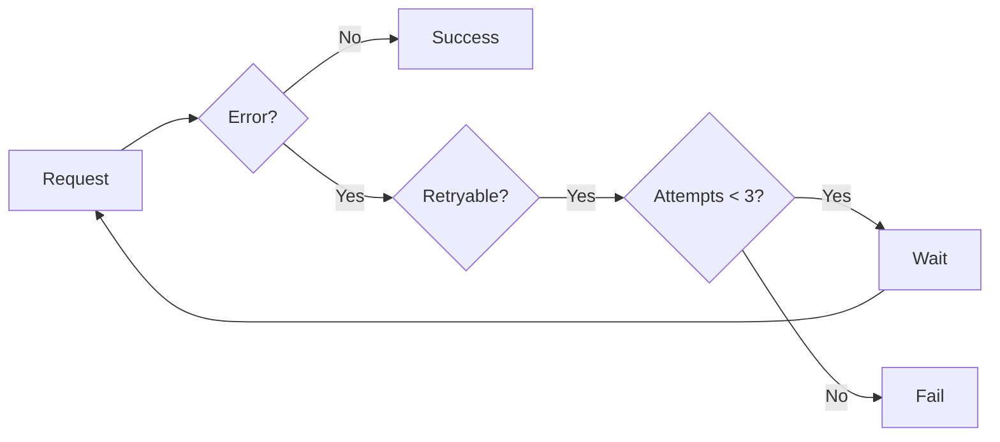
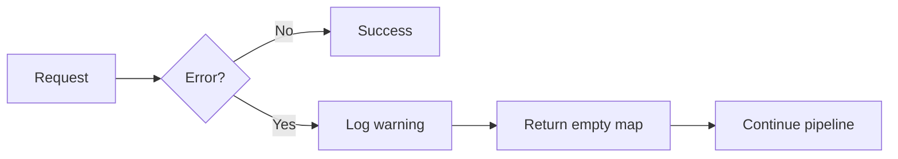

# API Interactions Documentation

External API integrations: Overpass API and Wikidata REST API.

## Overview



## Overpass API

### Purpose

Fetch administrative boundary data from OpenStreetMap with relation IDs and full geometries.

### API Details

| Property | Value |
|----------|-------|
| Endpoint | `https://overpass-api.de/api/interpreter` |
| Method | POST |
| Format | JSON |
| Timeout | 90 seconds |

### Query Types

#### 1. Country-Level Discovery Query

Fetches relations by ISO country code (for level 2/4):

```overpass
[out:json][timeout:90];
(
  relation["boundary"="administrative"]["admin_level"="4"]["ISO3166-1:alpha3"="BEL"];
);
out ids;
```

**Key points:**
- Uses `out ids` for fast discovery (no geometry)
- Filters by `ISO3166-1:alpha3` country tag
- Returns array of relation IDs only

#### 2. Child Discovery Query

Fetches child relations within parent boundary:

```overpass
[out:json][timeout:90];
(
  relation["boundary"="administrative"]["admin_level"="5"](area:3600012345);
);
out ids;
```

**Key points:**
- Uses Overpass area ID: `3600000000 + relationId`
- Searches for relations within parent area
- Returns array of child relation IDs

#### 3. Geometry Fetch Query

Fetches full polygon geometries for relations:

```overpass
[out:json][timeout:90];
(
  relation(id:123,456,789);
  way(r);
);
out geom;
```

**Key points:**
- Uses `out geom` to fetch full geometry
- Fetches ways that are members of relations
- Returns GeoJSON with polygon coordinates

### Request/Response Flow



### Response Structure

```json
{
  "version": 0.6,
  "generator": "Overpass API",
  "osm3s": {
    "timestamp_osm_base": "2024-01-30T00:00:00Z"
  },
  "elements": [
    {
      "type": "relation",
      "id": 12345,
      "tags": {
        "boundary": "administrative",
        "admin_level": "4",
        "name": "Brussels-Capital Region",
        "wikidata": "Q240",
        "ISO3166-1:alpha3": "BEL"
      },
      "members": [
        {
          "type": "way",
          "ref": 67890,
          "role": "outer",
          "geometry": [
            {"lat": 50.85, "lon": 4.35},
            {"lat": 50.86, "lon": 4.35},
            {"lat": 50.86, "lon": 4.36},
            {"lat": 50.85, "lon": 4.36},
            {"lat": 50.85, "lon": 4.35}
          ]
        }
      ]
    }
  ]
}
```

### Retry Logic

| Status Code | Retryable | Delay |
|-------------|-----------|-------|
| 429 Rate Limit | Yes | Exponential backoff |
| 5xx Server Error | Yes | Exponential backoff |
| 504 Timeout | Yes | Exponential backoff |
| 4xx Client Error | No | Fail fast |

**Retry Configuration:**
- Max attempts: 3
- Base delay: 1000ms
- Exponential base: 2
- Delays: 1000ms → 2000ms → 4000ms

## Wikidata REST API

### Purpose

Fetch Wikimedia Commons category names for administrative boundaries using Wikidata entity IDs.

### API Details

| Property | Value |
|----------|-------|
| Endpoint | `https://www.wikidata.org/w/api.php` |
| Action | `wbgetentities` |
| Method | GET |
| Format | JSON |
| Batch Size | 50 IDs max |
| Rate Limit | 100ms delay between batches |

### Request Format

```
GET /w/api.php?action=wbgetentities&ids=Q240|Q241|Q242&props=claims&format=json&formatversion=2
```

**Parameters:**
- `action=wbgetentities` - Fetch entity data
- `ids=Q240|Q241|Q242` - Pipe-separated Wikidata IDs (max 50)
- `props=claims` - Include claims (properties)
- `format=json` - JSON response
- `formatversion=2` - Modern JSON format

### P373 Property (Commons Category)

Wikidata stores the Wikimedia Commons category in property **P373**:

```json
{
  "entities": {
    "Q240": {
      "id": "Q240",
      "claims": {
        "P373": [
          {
            "mainsnak": {
              "datatype": "string",
              "datavalue": {
                "value": "Brussels-Capital Region",
                "type": "string"
              }
            }
          }
        ]
      }
    }
  }
}
```

**Extraction Path:** `entity.claims.P373[0].mainsnak.datavalue.value`

### Request/Response Flow



### Batch Processing

```typescript
const batchResults = yield* processInBatches(
  uniqueIds,      // ["Q240", "Q241", ..., "Q3000"]
  50,             // Batch size
  (batch, batchNum) => Effect.gen(function* () {
    // Fetch batch from Wikidata API
    const result = yield* tryAsync(async () => {
      const url = new URL('https://www.wikidata.org/w/api.php')
      url.searchParams.set('action', 'wbgetentities')
      url.searchParams.set('format', 'json')
      url.searchParams.set('formatversion', '2')
      url.searchParams.set('ids', batch.join('|'))

      const response = await fetch(url.toString(), {
        headers: { 'User-Agent': USER_AGENT }
      })

      return await response.json()
    }).pipe(
      Effect.catchAll((error) => {
        console.error(`Error processing batch ${batchNum}:`, error)
        return Effect.succeed({ entities: {} }) // Graceful degradation
      })
    )

    // Extract P373 values
    const categoryMap = new Map<string, string>()
    for (const [id, entity] of Object.entries(result.entities)) {
      if ('missing' in entity) continue

      const category = entity.claims?.P373?.[0]?.mainsnak?.datavalue?.value
      if (category) {
        categoryMap.set(id, category)
      }
    }

    return categoryMap
  }),
  {
    delayMs: 100,  // Rate limiting
    onProgress: (batchNum, totalBatches) =>
      console.log(`Processing batch ${batchNum}/${totalBatches}...`)
  }
)
```

### Error Handling

| Error Type | Handling |
|------------|----------|
| Network error | Log warning, skip batch |
| Timeout | Log warning, skip batch |
| 429 Rate limit | Retry with delay |
| 5xx Server error | Retry with backoff |
| Invalid response | Log error, skip batch |

**Key Behavior:** Batch failures don't stop the pipeline - they log warnings and continue with remaining batches.

### User Agent

```
Wikimedia Commons / User:DaxServer / geocode-commons-categories/1.0 (https://github.com/DaxServer/geocode-commons-categories)
```

## Integration Patterns

### Pattern 1: Retry with Backoff (Overpass)



### Pattern 2: Graceful Degradation (Wikidata)



## API Comparison

| Aspect | Overpass API | Wikidata API |
|--------|--------------|--------------|
| **Purpose** | Fetch OSM boundaries | Fetch Commons categories |
| **Query Format** | Overpass QL | HTTP GET params |
| **Batch Size** | 100 relations (geometry) | 50 IDs |
| **Rate Limit** | 250ms delay | 100ms delay |
| **Retry Logic** | Retry with backoff | Graceful degradation |
| **Failure Impact** | Stops pipeline | Continues (missing categories) |
| **Timeout** | 90 seconds | Default fetch timeout |
