# API Interactions Documentation

Detailed documentation of external API integrations (Overpass API and Wikidata REST API) used in the import pipeline.

## Overview

The import system integrates with two external APIs:

## Overpass API Integration

### Purpose

Fetch administrative boundary data from OpenStreetMap with geometry and metadata.

### API Details

### Query Construction

### Example Query

### Request Flow

### Response Structure

### Retry Logic

### Rate Limiting Strategy

## Wikidata REST API Integration

### Purpose

Fetch Wikimedia Commons category names for administrative boundaries using Wikidata entity IDs.

### API Details

### Request Format

### Batch Processing Flow

### Request/Response Sequence

```mermaid
sequenceDiagram
    participant Client as Import Script
    participant Batch as Batch Processor
    participant API as Wikidata API
    participant Map as Category Map

    Client->>Batch: fetchCategories(ids)
    activate Batch

    Batch->>Batch: Split 250 IDs into 5 batches

    loop For each batch of 50 IDs
        Batch->>API: GET wbgetentities with 50 IDs
        activate API

        API->>API: Lookup entities
        API->>API: Extract claims
        API-->>Batch: JSON response
        deactivate API

        Batch->>Batch: Parse response

        loop For each entity in batch
            Batch->>Batch: Check for P373 claim
            alt P373 exists
                Batch->>Map: Map["Q123"] = "Category:Name"
            else P373 missing
                Batch->>Batch: Skip entity (graceful)
            end
        end

        Batch->>Batch: Wait 100ms (rate limit)
    end

    Batch-->>Client: Map<string, string>
    deactivate Batch

    Note over Map: Returns map of<br/>Q ID → Commons category
```

### Response Structure

### Property Extraction

### Error Handling

