# Import System Architecture

High-level architecture, component relationships, and system configuration for the data import pipeline.

## System Architecture Overview

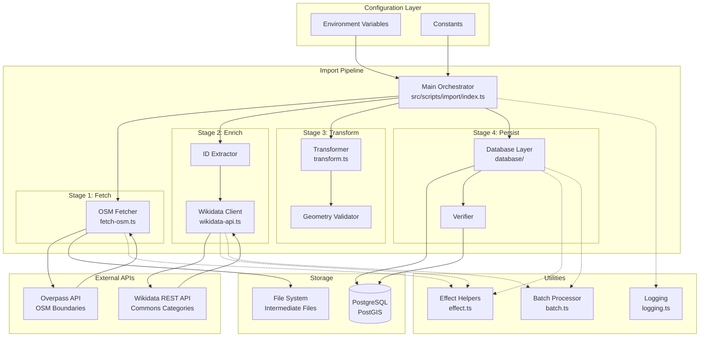

## Component Hierarchy

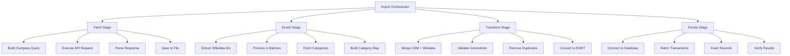

## Module Responsibilities

### File Structure

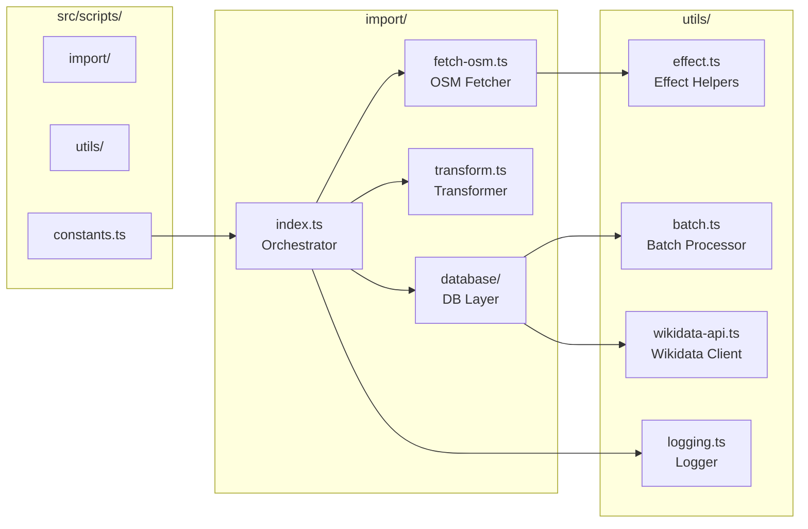

## Configuration Architecture

### Environment Variable Flow

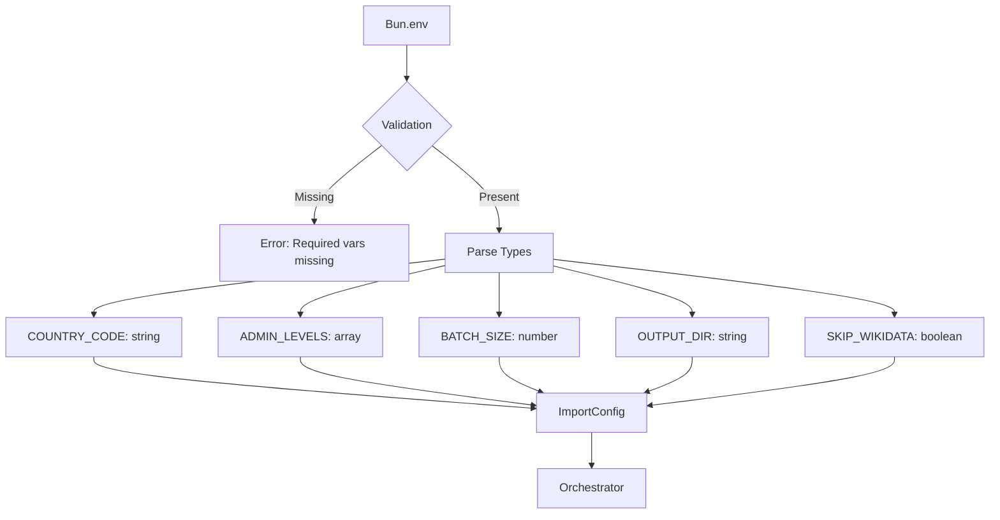

### Constants Configuration

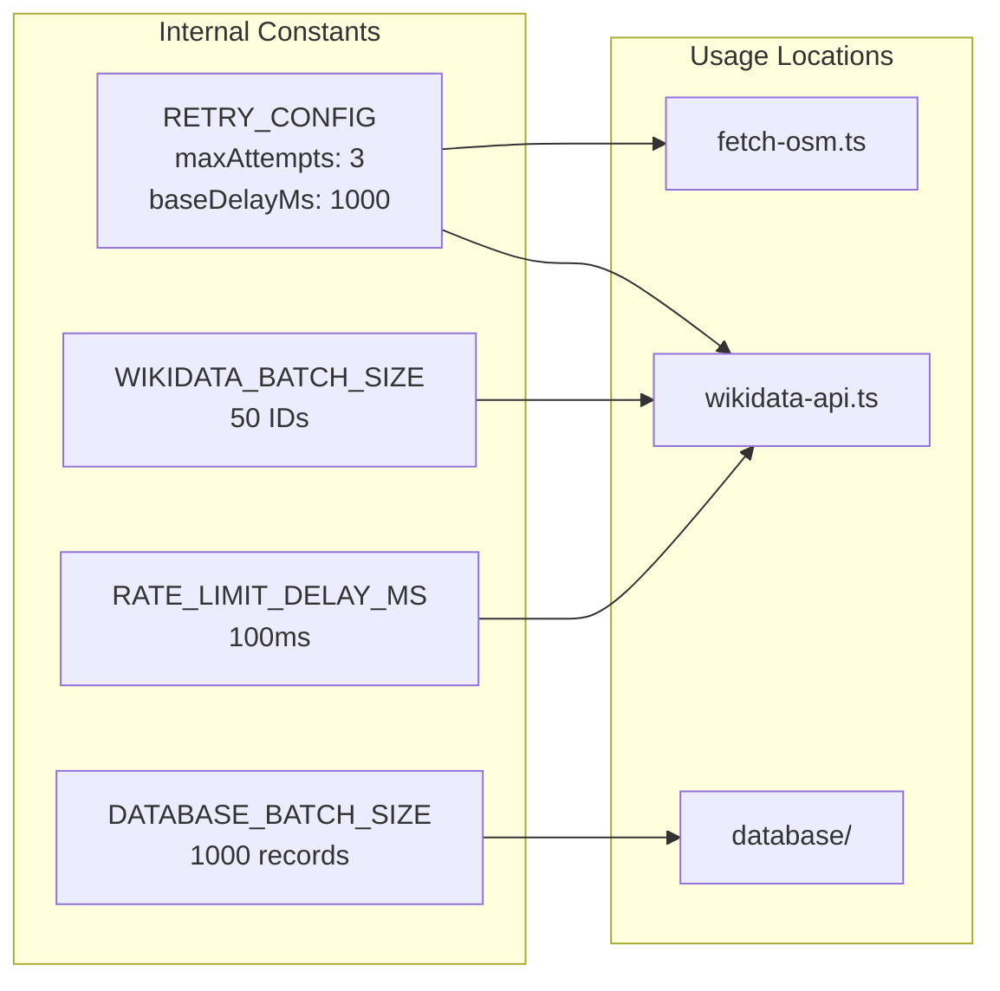

## Database Architecture

### Schema Design

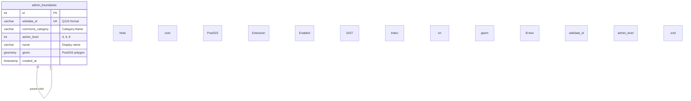

**Note**: PostGIS Extension Enabled, GIST Index on geom, B-tree Index on wikidata_id and admin_level

### Connection Pool Architecture

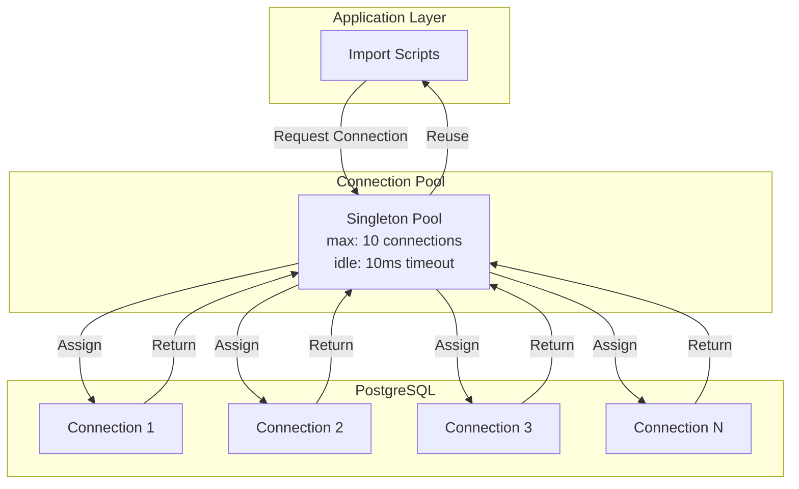

## Data Models

### Type Hierarchy

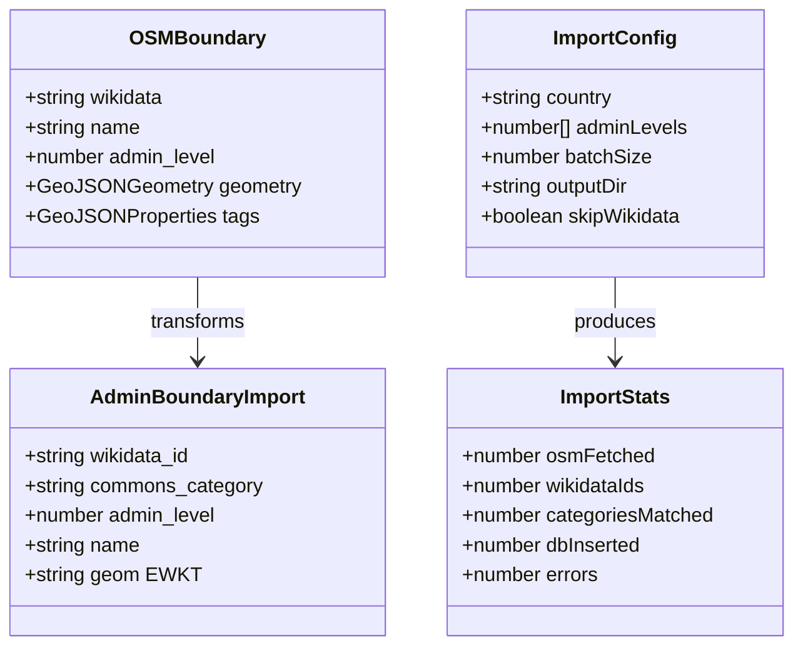

### State Management

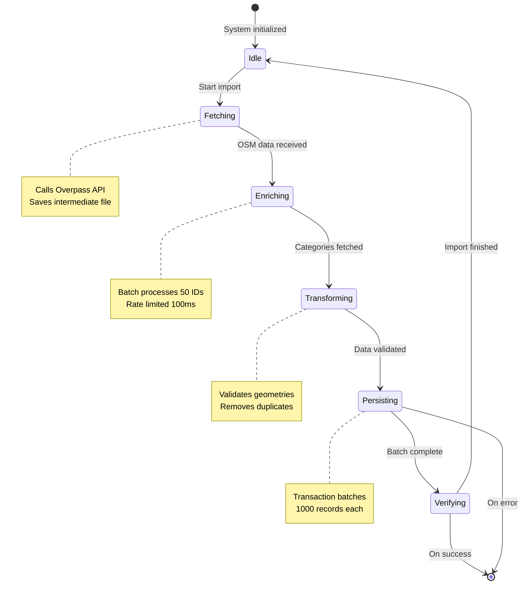

## Execution Models

### Sequential Pipeline Execution

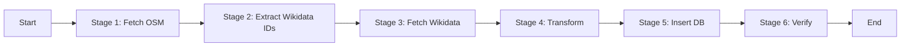

### Parallel Batch Processing (Wikidata)

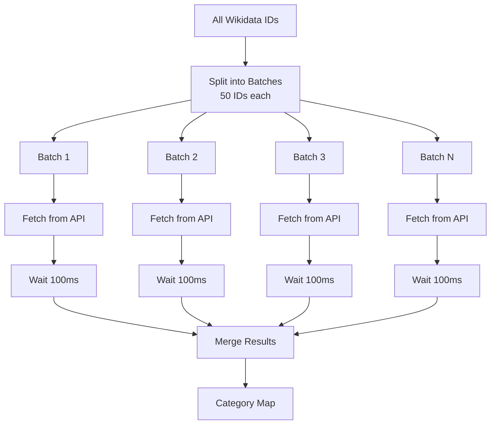

## Technology Stack

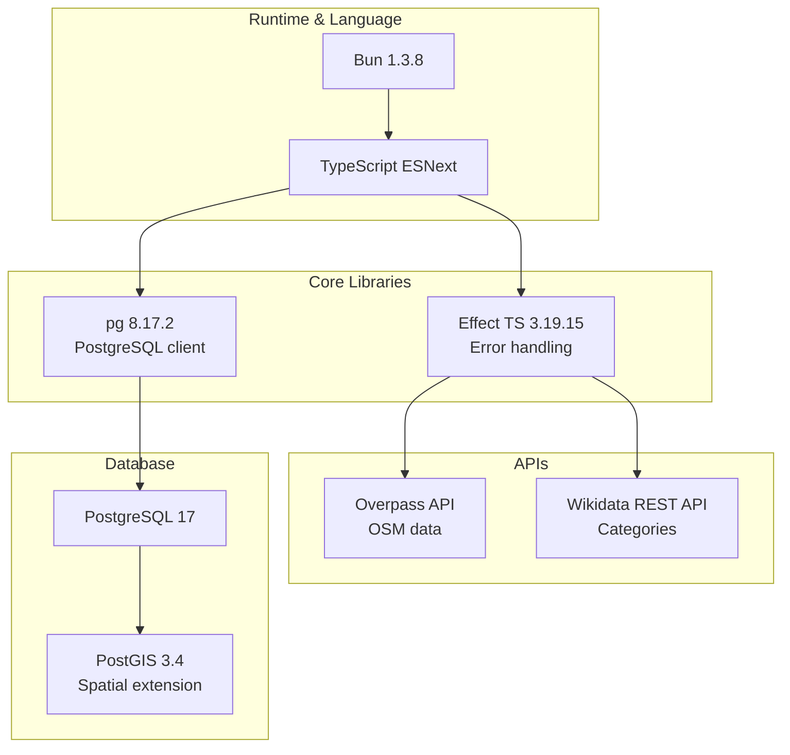
