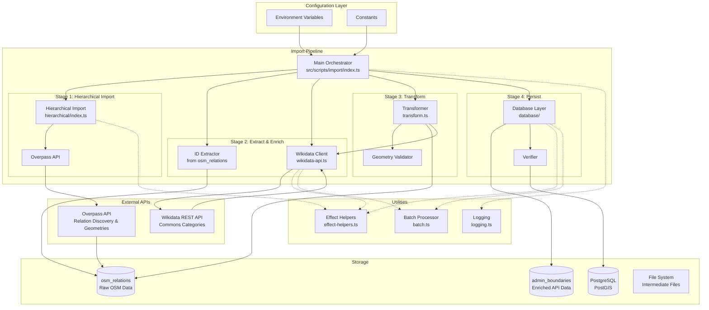
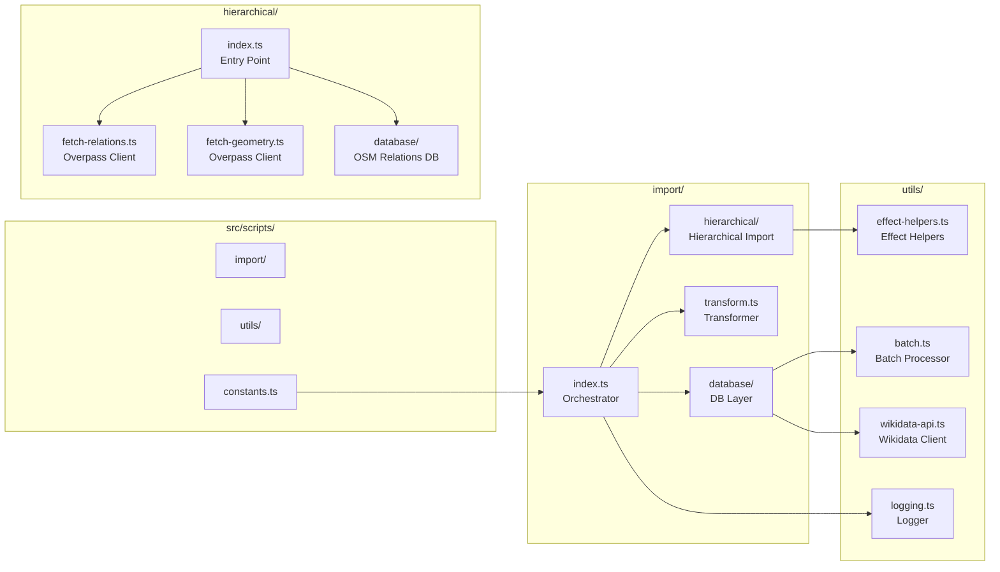
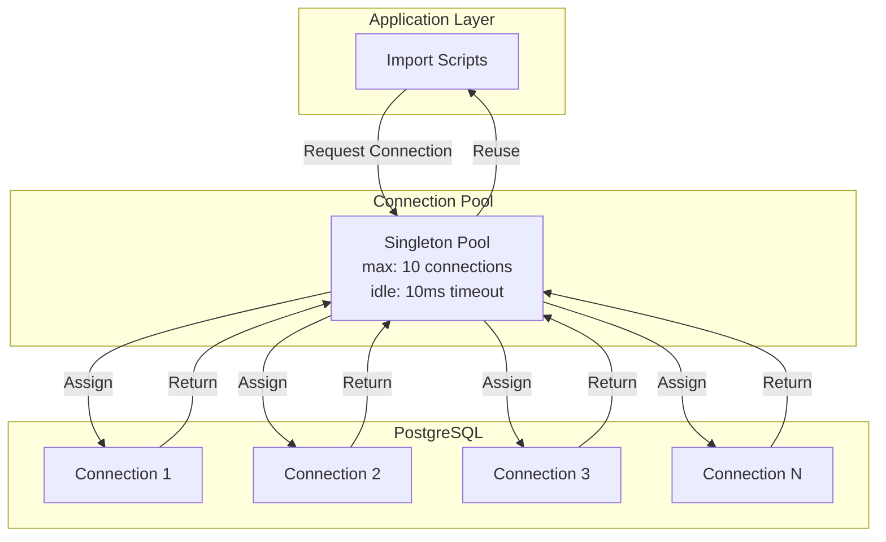
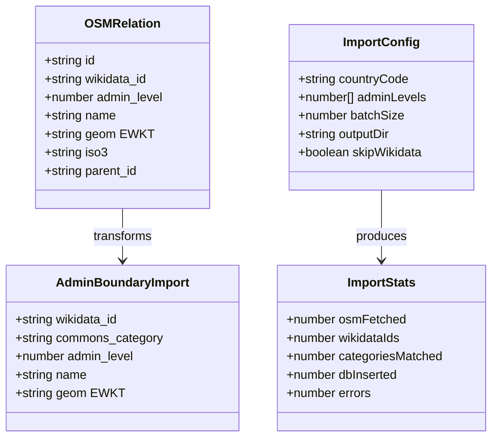
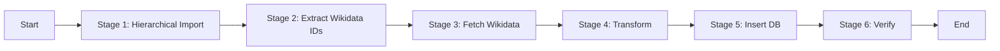
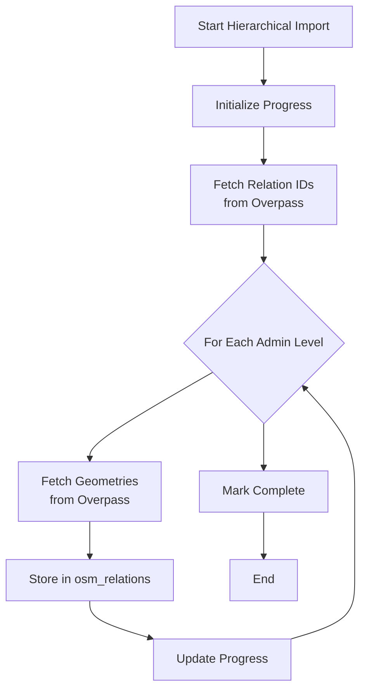
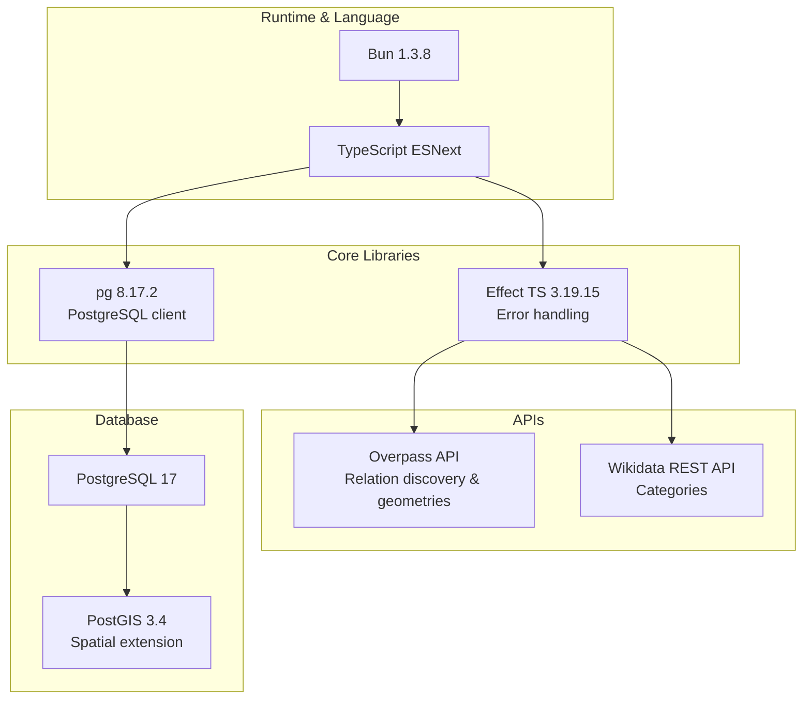

# Import System Architecture

High-level architecture, component relationships, and system configuration for the data import pipeline.

## System Architecture Overview



## Two-Table Architecture

```mermaid
graph LR
    subgraph "Hierarchical Import"
        A1[Overpass API] --> A2[Discover Relations]
        A2 --> A3[Fetch Relation IDs]
        A3 --> A4[Fetch Geometries]
        A4 --> A5[Store in osm_relations]
    end

    subgraph "Main Pipeline"
        A5 --> B1[Extract Wikidata IDs]
        B1 --> B2[Wikidata API]
        B2 --> B3[Fetch Categories]
        B3 --> B4[Transform & Validate]
        B4 --> B5[Store in admin_boundaries]
    end

    subgraph "API Usage"
        B5 --> C1[Reverse Geocoding]
        C1 --> C2[/geocode endpoint]
    end
```

## Module Responsibilities

### File Structure



## Database Architecture

### Schema Design

```mermaid
erDiagram
    osm_relations ||--o| osm_relations : "parent-child"
    osm_relations {
        bigint id PK "OSM Relation ID"
        varchar wikidata_id UK "Q123 format"
        int admin_level "2-11"
        varchar name "Display name"
        geometry geom "PostGIS polygon"
        varchar iso3 "ISO3 code"
        bigint parent_id FK "Parent relation"
        timestamp created_at
    }

    admin_boundaries {
        int id PK
        varchar wikidata_id UK "Q123 format"
        varchar commons_category "Category:Name"
        int admin_level "4, 6, 8"
        varchar name "Display name"
        geometry geom "PostGIS polygon"
        timestamp created_at
    }

    Note over osm_relations,admin_boundaries
        osm_relations: Raw OSM data with full geometries
        admin_boundaries: Enriched data for API
        Populated by hierarchical import → main pipeline
    end Note
```

**Indexes**:
- `osm_relations`: GIST on geom, b-tree on wikidata_id, admin_level, iso3
- `admin_boundaries`: GIST on geom, b-tree on wikidata_id, admin_level

### Connection Pool Architecture



## Data Models

### Type Hierarchy



## Execution Models

### Sequential Pipeline Execution



### Hierarchical Import Flow



## Technology Stack


