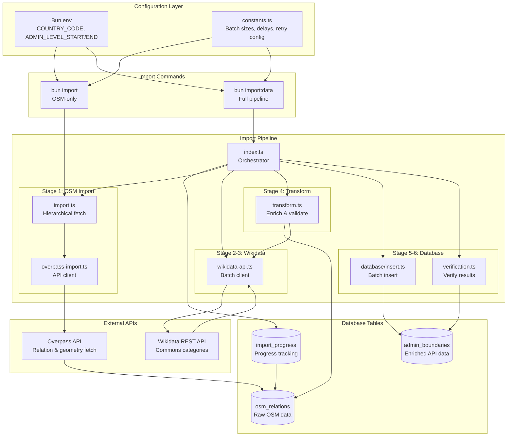
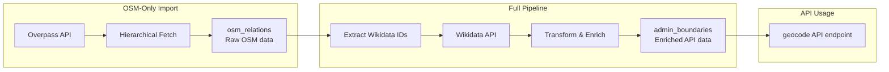
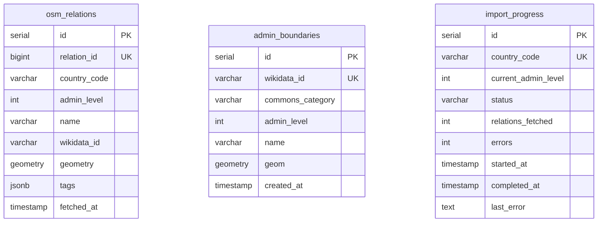
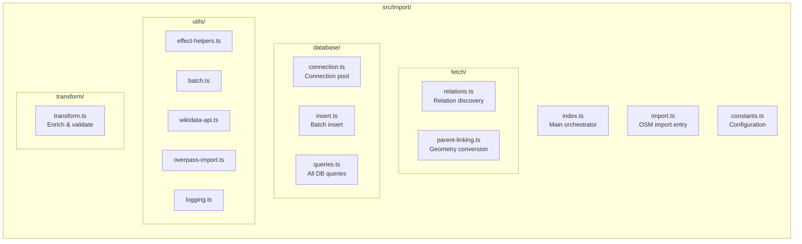
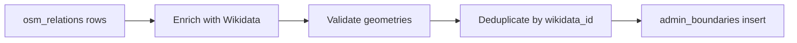
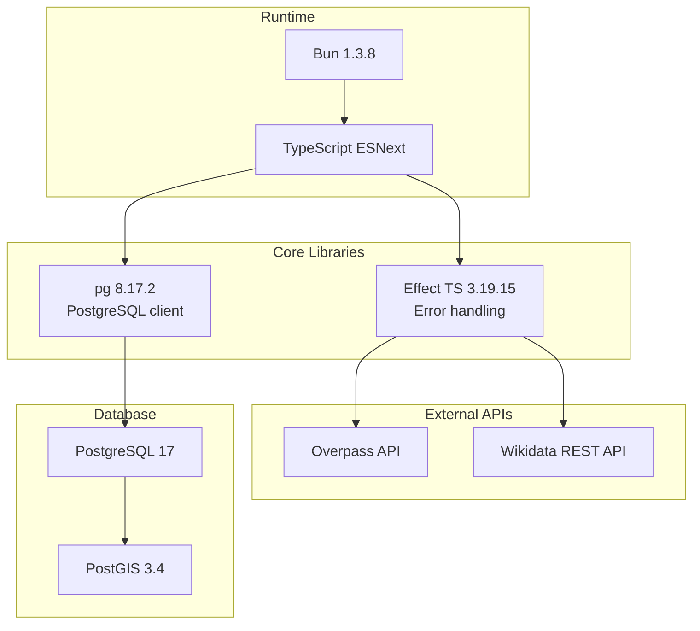

# Import System Architecture

High-level architecture, component relationships, and system configuration.

## System Architecture Overview



## Two-Table Architecture



## Database Schema

### osm_relations Table (Raw OSM Data)

| Column | Type | Description |
|--------|------|-------------|
| `id` | serial | Auto-increment primary key |
| `relation_id` | bigint | OSM relation ID (unique with country_code) |
| `country_code` | varchar(3) | ISO 3166-1 alpha-3 country code |
| `admin_level` | int | Administrative level (2-11) |
| `name` | varchar | Display name |
| `wikidata_id` | varchar(20) | Wikidata ID (Q123 format, nullable) |
| `geometry` | geometry | PostGIS polygon (SRID=4326) |
| `tags` | jsonb | OSM tags as JSON |
| `fetched_at` | timestamp | When the data was fetched |

**Indexes:**
- GIST spatial index on `geometry`
- B-tree indexes on `relation_id`, `country_code`, `admin_level`, `wikidata_id`

### admin_boundaries Table (Enriched API Data)

| Column | Type | Description |
|--------|------|-------------|
| `id` | serial | Auto-increment primary key |
| `wikidata_id` | varchar | Wikidata ID (Q123 format, unique) |
| `commons_category` | varchar | Wikimedia Commons category |
| `admin_level` | int | Administrative level (1-10) |
| `name` | varchar | Display name |
| `geom` | geometry | PostGIS polygon (SRID=4326) |
| `created_at` | timestamp | Creation timestamp |

**Indexes:**
- GIST spatial index on `geom`
- B-tree indexes on `wikidata_id`, `admin_level`

### import_progress Table (Progress Tracking)

| Column | Type | Description |
|--------|------|-------------|
| `id` | serial | Auto-increment primary key |
| `country_code` | varchar(3) | ISO country code (unique) |
| `current_admin_level` | int | Current admin level being processed |
| `status` | varchar(20) | Status: 'pending', 'in_progress', 'completed', 'failed' |
| `relations_fetched` | int | Number of relations fetched so far |
| `errors` | int | Number of errors encountered |
| `started_at` | timestamp | When import started |
| `completed_at` | timestamp | When import completed (null if pending/failed) |
| `last_error` | text | Last error message (null if no errors) |

**Indexes:**
- B-tree index on `status`
- Unique constraint on `country_code`

### Schema Relationship



**Schema Notes:**
- **osm_relations**: Raw OSM data with full geometries
- **admin_boundaries**: Enriched data for API
- **Populated by**:
  - `bun import` → osm_relations only
  - `bun import:data` → osm_relations + admin_boundaries

## Module Structure



## Key Implementation Details

### Hierarchical Discovery

The import system discovers administrative boundaries hierarchically:

1. **Level 2 (Country):** Fetched by `ISO3166-1:alpha3` tag
   ```typescript
   relation["boundary"="administrative"]["admin_level"="2"]["ISO3166-1:alpha3"="BEL"]
   ```

2. **Level 3+ (Children):** Fetched as children within previous level's area
   ```typescript
   // Convert relation ID to Overpass area ID
   const areaId = 3600000000 + relationId

   // Query for children within parent area
   relation["boundary"="administrative"]["admin_level"="3"](area:areaId)
   ```

**Note:** The `parent_id` column was removed in migration 003 as it's not used by the API.

### Overpass API Queries

**Discovery Query (out ids):**
```overpass
[out:json][timeout:90];
(
  relation["boundary"="administrative"]["admin_level"="4"]["ISO3166-1:alpha3"="BEL"];
);
out ids;
```

**Child Discovery Query:**
```overpass
[out:json][timeout:90];
(
  relation["boundary"="administrative"]["admin_level"="5"](area:3600012345);
);
out ids;
```

**Geometry Fetch Query:**
```overpass
[out:json][timeout:90];
(
  relation(id:123,456,789);
  way(r);
);
out geom;
```

### Wikidata API Integration

**Request Format:**
```
GET /w/api.php?action=wbgetentities&ids=Q1|Q2|...|Q50&props=claims&format=json
```

**P373 Property Extraction:**
```typescript
// Navigate to Commons category
const category = entity.claims?.P373?.[0]?.mainsnak?.datavalue?.value
// Returns: "Category:Brussels-Capital Region"
```

### Constants Reference

| Constant | Value | Description |
|----------|-------|-------------|
| `BATCH_SIZES.WIKIDATA` | 50 | Max IDs per Wikidata API request |
| `BATCH_SIZES.DATABASE` | 1000 | Records per database transaction |
| `BATCH_SIZES.OVERPASS_GEOMETRY` | 100 | Relations per geometry fetch |
| `DELAYS.RATE_LIMIT_MS` | 100 | Delay between Wikidata batches |
| `DELAYS.OVERPASS_GEOMETRY_MS` | 250 | Delay between Overpass geometry requests |
| `DELAYS.RETRY_EXPONENTIAL_BASE` | 2 | Exponential base for retry delays |
| `DELAYS.COUNTRY_BATCH_MS` | 5000 | Delay between country batches (multi-country) |
| `RETRY_CONFIG.MAX_ATTEMPTS` | 3 | Max retry attempts for API calls |
| `RETRY_CONFIG.BASE_DELAY_MS` | 1000 | Base delay for exponential backoff |
| `IMPORT.COUNTRY_BATCH_SIZE` | 5 | Countries per batch (multi-country) |
| `IMPORT.OVERPASS_TIMEOUT` | 90 | Overpass query timeout (seconds) |

**Retry Delay Formula:** `delay = BASE_DELAY_MS × RETRY_EXPONENTIAL_BASE^(attempt-1)`
- Attempt 1: 1000ms
- Attempt 2: 2000ms
- Attempt 3: 4000ms

### Effect TS Error Handling

```typescript
// Standard error wrapper
export const tryAsync = <T>(
  tryFn: () => Promise<T>,
  context?: string
): Effect.Effect<T, Error> => {
  return Effect.tryPromise({
    try: tryFn,
    catch: (error) => new Error(`${context}: ${error}`)
  })
}
```

### Data Transform Pipeline



**Transform Steps:**
1. **Enrich:** Match `wikidata_id` with Commons category map
2. **Validate:** Check EWKT format and polygon structure
3. **Deduplicate:** Remove duplicate `wikidata_id` entries
4. **Filter:** Exclude records without categories or invalid geometries

## Technology Stack


