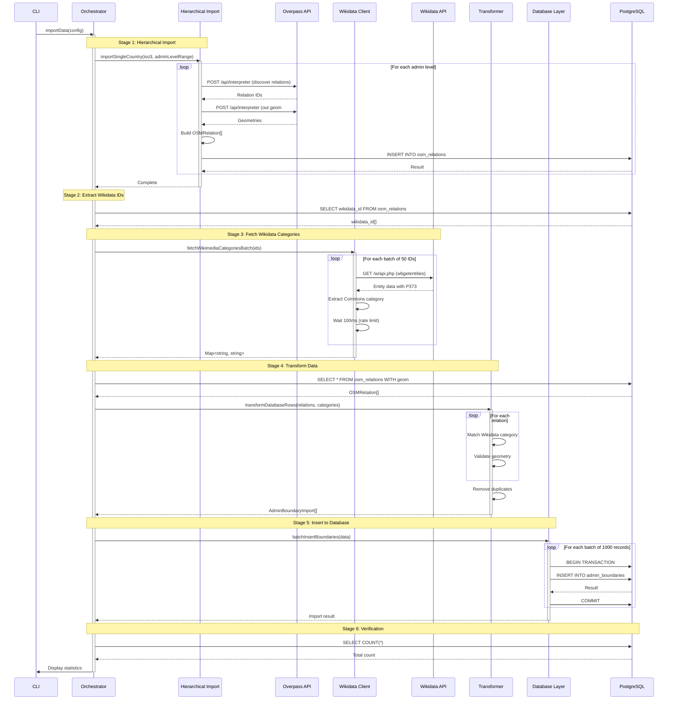
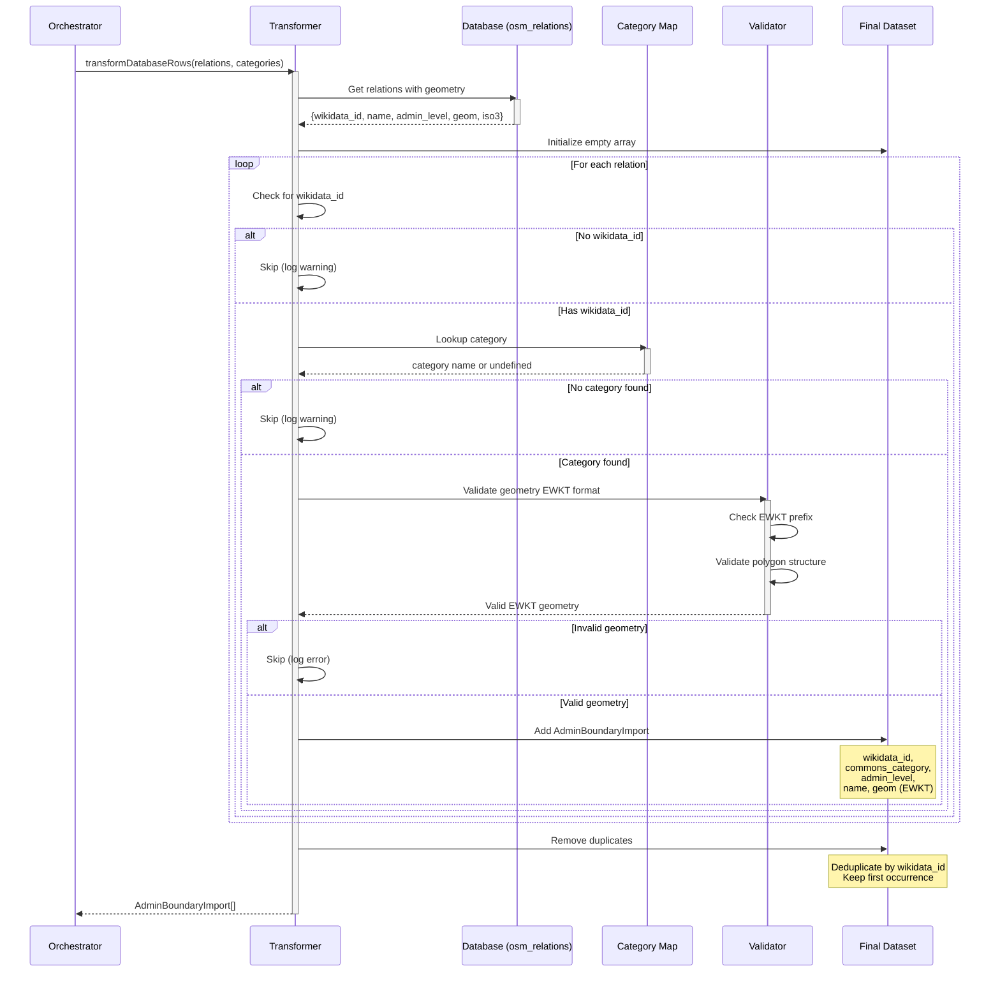
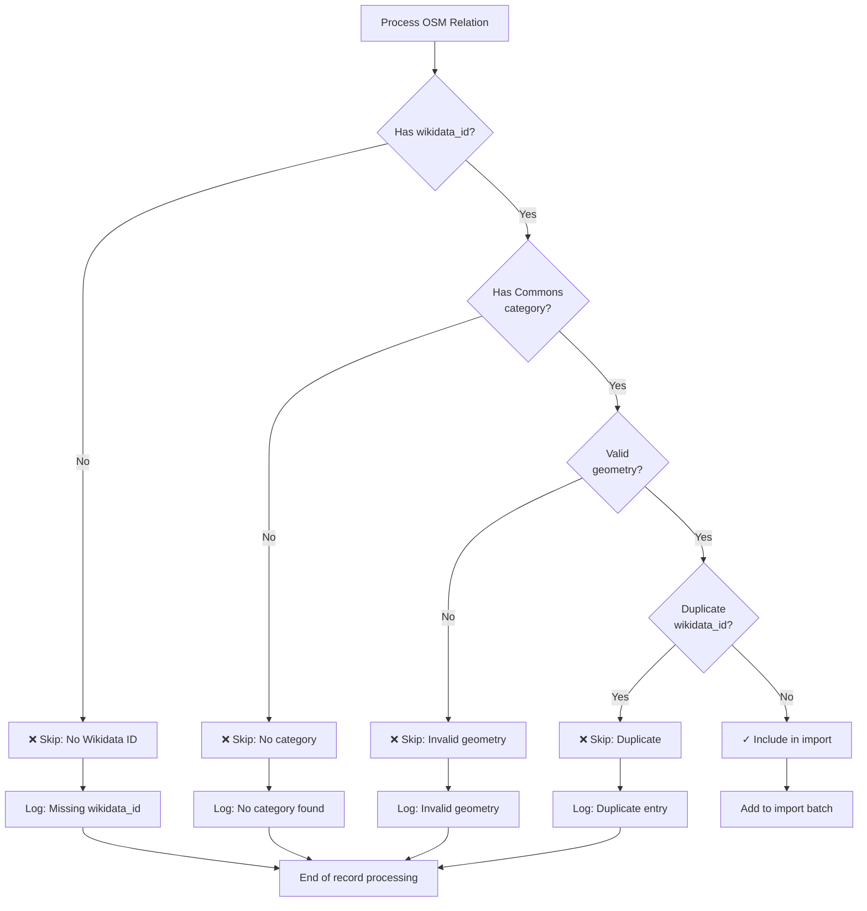
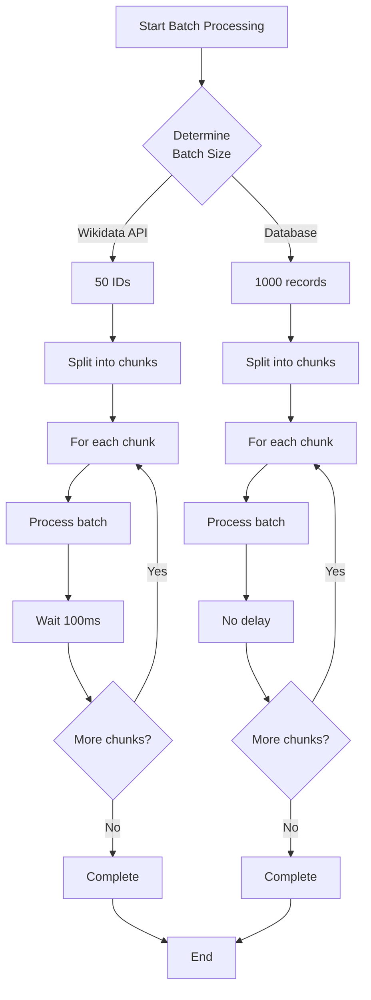

# Data Flow Documentation

Complete data flow diagrams, sequence diagrams, and state transitions for the import pipeline.

## Complete Data Flow Overview

```mermaid
graph TB
    subgraph "Stage 1: Hierarchical Import (→ osm_relations)"
        A1[Start Import] --> A2[Build Overpass Query]
        A2 --> A3[Discover Relations<br/>by admin_level]
        A3 --> A4{Has Relations?}
        A4 -->|No| A5[Skip Level]
        A4 -->|Yes| A5[Build Overpass Geometry Query]
        A5 --> A6[POST Overpass API<br/>out geom;]
        A7 --> A8[Parse Geometries]
        A8 --> A9["Build OSMRelation array"]
        A9 --> A10["Insert to osm_relations"]
        A10 --> A11{More Levels?}
        A11 -->|Yes| A2
        A11 -->|No| A12[Complete Hierarchical Import]
    end

    subgraph "Stage 2: Extract Wikidata IDs"
        A12 --> B1[Query osm_relations]
        B1 --> B2[Extract wikidata_id column]
        B2 --> B3[Filter NULL values]
        B3 --> B4[Count unique IDs]
        B4 --> B5{Has IDs?}
        B5 -->|No| B6[Skip Wikidata Stage]
        B5 -->|Yes| B7[Pass to Stage 3]
    end

    subgraph "Stage 3: Fetch Wikidata Categories"
        B7 --> C1[Split into Batches of 50]
        C1 --> C2[For Each Batch]
        C2 --> C3[GET Wikidata API]
        C3 --> C4[Extract P373 Property]
        C4 --> C5[Add to Category Map]
        C5 --> C6{More Batches?}
        C6 -->|Yes| C7[Wait 100ms]
        C7 --> C2
        C6 -->|No| C8[Complete Category Map]
    end

    subgraph "Stage 4: Transform"
        B6 --> D1[Query osm_relations<br/>with geometry]
        C8 --> D1
        D1 --> D2[For Each Relation]
        D2 --> D3{Has Wikidata?}
        D3 -->|No| D4[Skip Record]
        D3 -->|Yes| D5{Has Category?}
        D5 -->|No| D4
        D5 -->|Yes| D6[Validate Geometry]
        D6 --> D7{Valid?}
        D7 -->|No| D4
        D7 -->|Yes| D8[Verify EWKT Format]
        D8 --> D9[Add to Results]
        D9 --> D10{More Records?}
        D10 -->|Yes| D2
        D10 -->|No| D11[Remove Duplicates]
        D11 --> D12[Final Dataset]
    end

    subgraph "Stage 5: Database Insert"
        D12 --> E1[Connect to PostgreSQL]
        E1 --> E2[Split into Batches of 1000]
        E2 --> E3[For Each Batch]
        E3 --> E4[Begin Transaction]
        E4 --> E5[Insert Records<br/>ON CONFLICT DO UPDATE]
        E5 --> E6{Success?}
        E6 -->|Yes| E7[Commit Transaction]
        E6 -->|No| E8[Rollback]
        E8 --> E9[Log Error]
        E7 --> E10{More Batches?}
        E10 -->|Yes| E3
        E10 -->|No| E11[Close Connection]
    end

    subgraph "Stage 6: Verification"
        E11 --> F1[Query Total Count]
        F1 --> F2[Group by Admin Level]
        F2 --> F3[Check for NULLs]
        F3 --> F4[Validate Geometries]
        F4 --> F5[Display Statistics]
        F5 --> F6[Import Complete]
    end
```



## Sequence Diagrams

### Main Import Pipeline Sequence



### Hierarchical Import Sequence

```mermaid
sequenceDiagram
    participant Script as Import Script
    participant Hier as Hierarchical Import
    participant Overpass as Overpass API
    participant PG as PostgreSQL

    Script->>Hier: importSingleCountry(iso3, adminLevelRange)
    activate Hier

    Hier->>PG: Initialize progress tracking
    PG-->>Hier: Ready

    loop For each admin level
        Hier->>Overpass: POST /api/interpreter (discover relations)
        activate Overpass
        Overpass-->>Hier: Relation IDs[]
        deactivate Overpass

        alt No relations at this level
            Hier->>Hier: Continue to next level
        else Has relations
            loop For each batch of IDs
                Hier->>Overpass: POST /api/interpreter
                activate Overpass
                Note over Hier,Overpass: out geom; for full geometry
                Overpass-->>Hier: GeoJSON geometries
                deactivate Overpass

                Hier->>Hier: Parse and convert to OSMRelation
                Hier->>PG: INSERT INTO osm_relations
                PG-->>Hier: Insert result
            end

            Hier->>PG: Update progress
        end
    end

    Hier->>PG: Mark as completed
    Hier-->>Script: Complete
    deactivate Hier
```

### Transform and Validation Sequence



## State Diagrams

### Import Process State Machine

```mermaid
stateDiagram-v2
    [*] --> Initializing: Load config

    Initializing --> HierarchicalImport: Config validated

    state HierarchicalImport {
        [*] --> DiscoverRelations
        DiscoverRelations --> CheckRelations
        CheckRelations --> FetchGeometries: Has relations
        CheckRelations --> [*]: No relations, skip level
        FetchGeometries --> StoreRelations
        StoreRelations --> UpdateProgress
        UpdateProgress --> DiscoverRelations: More levels?
        UpdateProgress --> [*]: All levels done
    }

    HierarchicalImport --> ExtractingIDs: Complete

    state ExtractingIDs {
        [*] --> QueryDatabase
        QueryDatabase --> ExtractIDs
        ExtractIDs --> FilterNulls
        FilterNulls --> [*]
    }

    ExtractingIDs --> FetchingWikidata: Has IDs
    ExtractingIDs --> SkippingWikidata: No IDs or SKIP_WIKIDATA

    state FetchingWikidata {
        [*] --> CreateBatches
        CreateBatches --> ProcessingBatches

        ProcessingBatches --> FetchBatch: Next batch
        FetchBatch --> ExtractCategories
        ExtractCategories --> RateLimitDelay
        RateLimitDelay --> ProcessingBatches: More batches?
        ProcessingBatches --> [*]: All batches done
    }

    state SkippingWikidata {
        [*] --> LogSkip
        LogSkip --> [*]
    }

    SkippingWikidata --> Transforming
    FetchingWikidata --> Transforming

    state Transforming {
        [*] --> QueryRelations
        QueryRelations --> ProcessingRecords
        ProcessingRecords --> ValidateRecord: Next record
        ValidateRecord --> Enriching
        Enriching --> CheckingGeometry
        CheckingGeometry --> ProcessingRecords: More records?
        ProcessingRecords --> Deduplicating
        Deduplicating --> [*]
    }

    Transforming --> InsertingDatabase

    state InsertingDatabase {
        [*] --> CreatingBatches
        CreatingBatches --> ProcessingBatch: Next batch
        ProcessingBatch --> BeginTransaction
        BeginTransaction --> InsertingRecords
        InsertingRecords --> Committing
        Committing --> ProcessingBatch: More batches?
        ProcessingBatch --> [*]: All done
    }

    InsertingDatabase --> Verifying

    state Verifying {
        [*] --> CountingRecords
        CountingRecords --> GroupingByLevel
        GroupingByLevel --> CheckingNulls
        CheckingNulls --> ValidatingGeometries
        ValidatingGeometries --> [*]
    }

    Verifying --> [*]: Complete

    Initializing --> [*]: Config error
    HierarchicalImport --> [*]: API failure
    InsertingDatabase --> [*]: Database error
```



## Filter and Decision Flows

### Record Filtering Logic



### Batch Processing Flow


