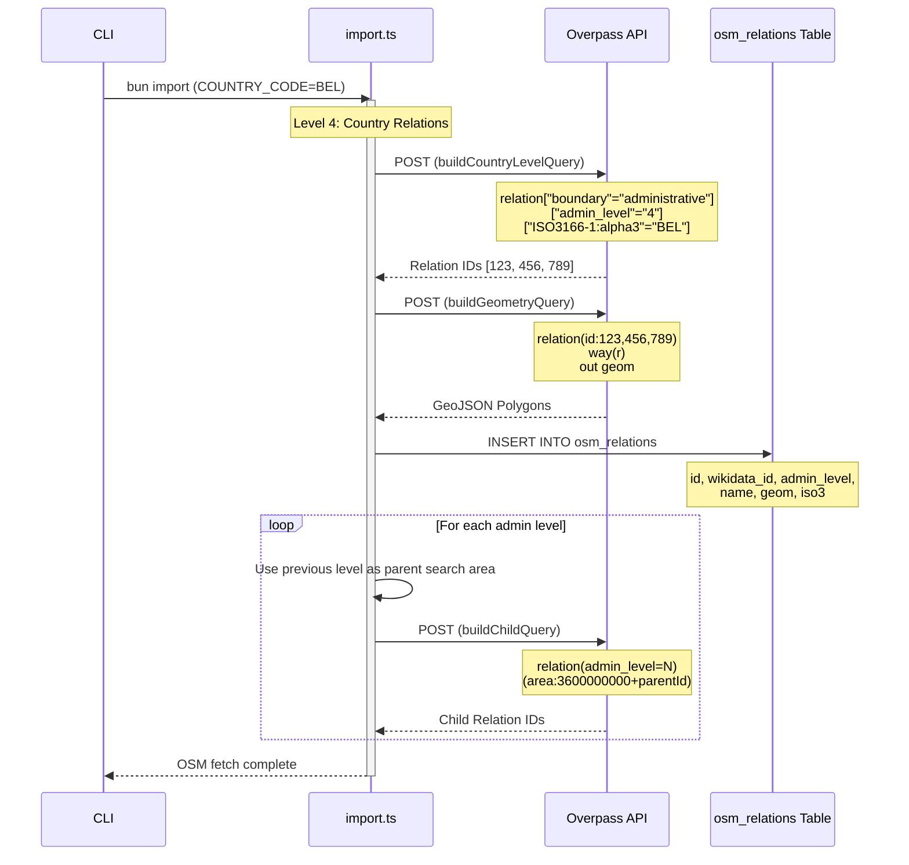
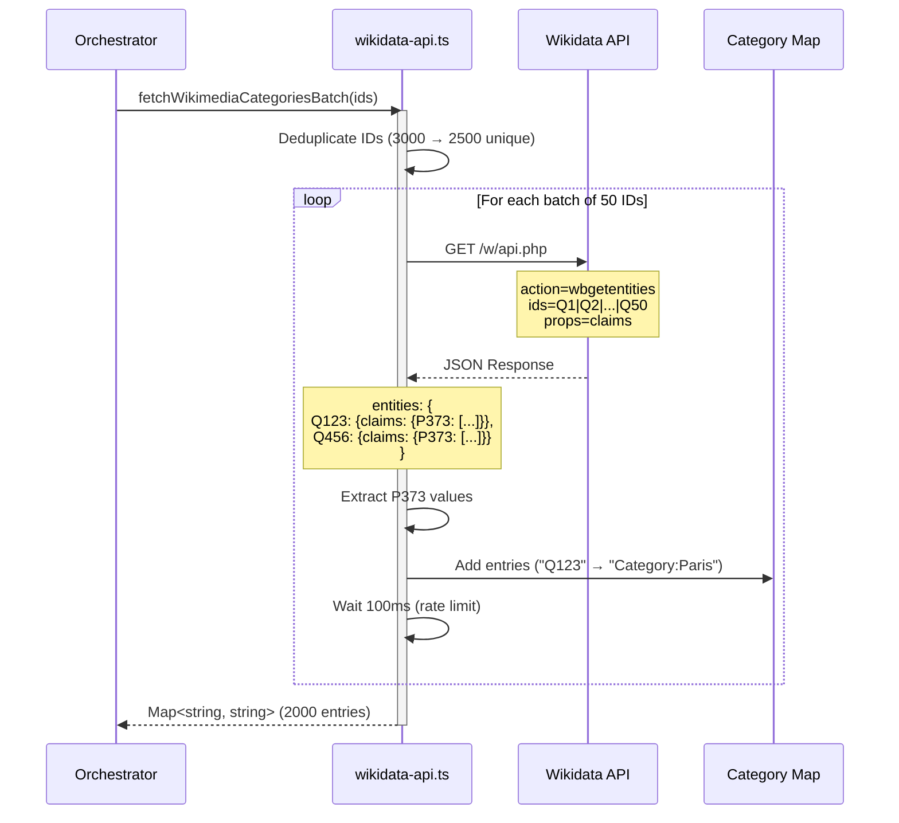
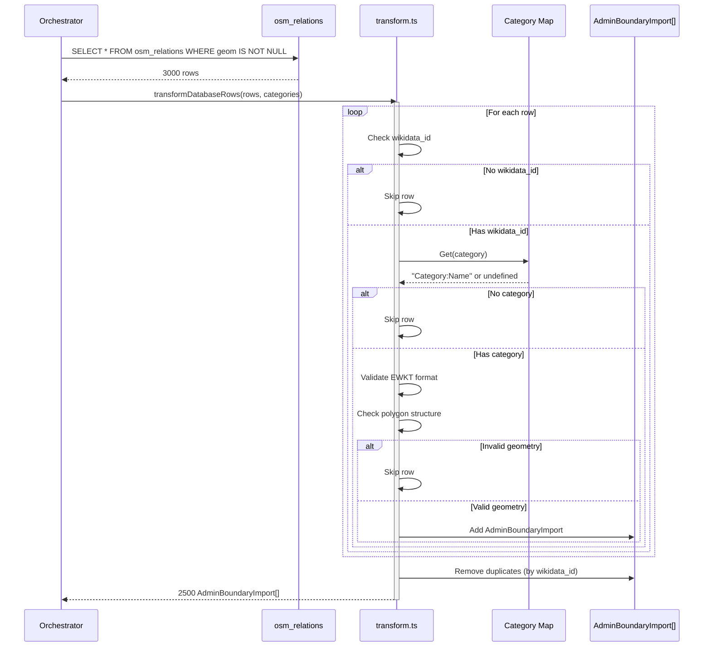
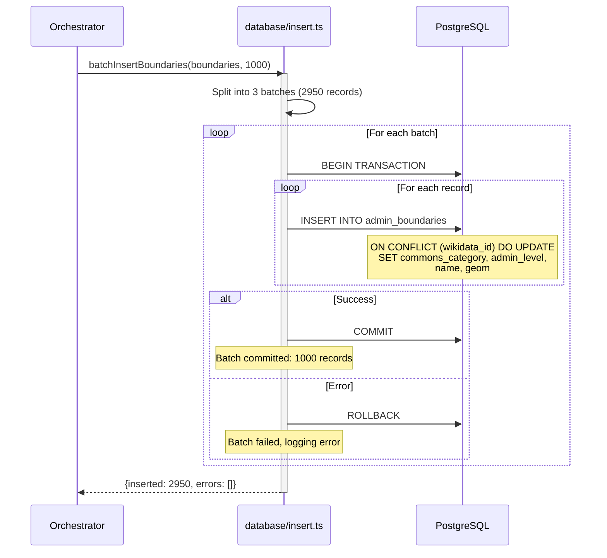
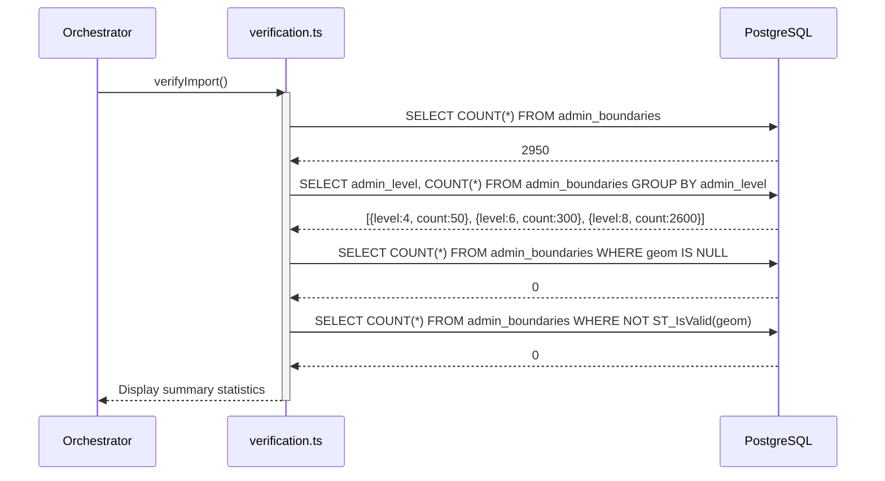
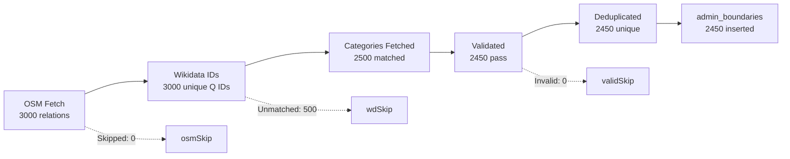
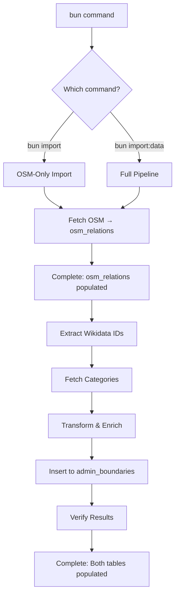

# Data Flow Documentation

Data flow diagrams for the import pipeline showing how data moves through each stage.

## Complete Pipeline Flow

```mermaid
graph TB
    START[Start Import] --> S1[Stage 1: Fetch OSM]

    subgraph "Stage 1: Fetch OSM Data"
        S1_1[Discover Relations by Admin Level]
        S1_2[Fetch Child Relations Hierarchically]
        S1_3[Fetch Full Geometries]
        S1_4[Store in osm_relations]
    end

    S1_4 --> S2[Stage 2: Extract Wikidata IDs]

    subgraph "Stage 2: Extract Wikidata IDs"
        S2_1[Query osm_relations Table]
        S2_2[Filter NULL Values]
        S2_3[Return Unique ID Array]
    end

    S2_3 --> S3[Stage 3: Fetch Wikidata Categories]

    subgraph "Stage 3: Fetch Wikidata Categories"
        S3_1[Split into Batches of 50]
        S3_2[Fetch via wbgetentities API]
        S3_3[Extract P373 Property]
        S3_4[Build Category Map]
    end

    S3_4 --> S4[Stage 4: Transform and Enrich]

    subgraph "Stage 4: Transform and Enrich"
        S4_1[Merge OSM + Wikidata Data]
        S4_2[Validate Geometries]
        S4_3[Remove Duplicates]
        S4_4[Filter Missing Categories]
    end

    S4_4 --> S5[Stage 5: Database Insert]

    subgraph "Stage 5: Database Insert"
        S5_1[Split into Batches of 1000]
        S5_2[Insert with ON CONFLICT]
        S5_3[Commit Transaction]
    end

    S5_3 --> S6[Stage 6: Verification]

    subgraph "Stage 6: Verification"
        S6_1[Query Total Count]
        S6_2[Group by Admin Level]
        S6_3[Validate Geometries]
    end

    S6_3 --> COMPLETE[Import Complete]
```

## OSM Fetch Sequence (Stage 1)

## Wikidata Fetch Sequence (Stage 3)

## Transform Sequence (Stage 4)

## Database Insert Sequence (Stage 5)

## Verification Sequence (Stage 6)

## Data Volume Flow

## Import Commands Flow

