# Error Handling Documentation

Complete error handling patterns, retry logic, and failure recovery mechanisms for the import pipeline.

## Error Handling Overview

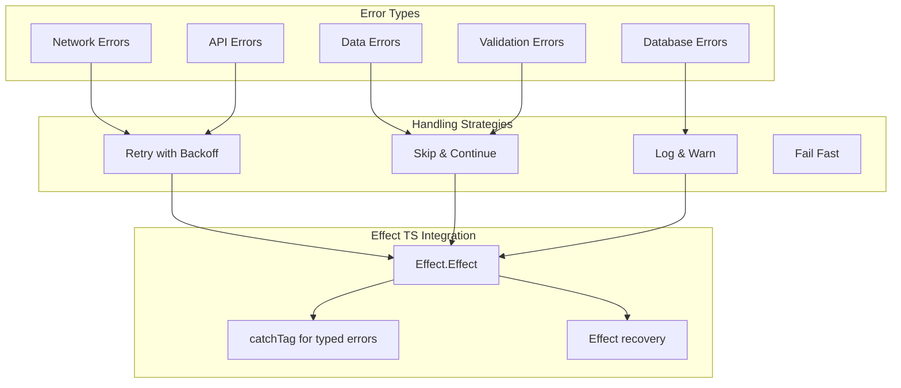

## Error Taxonomy

### Error Class Hierarchy

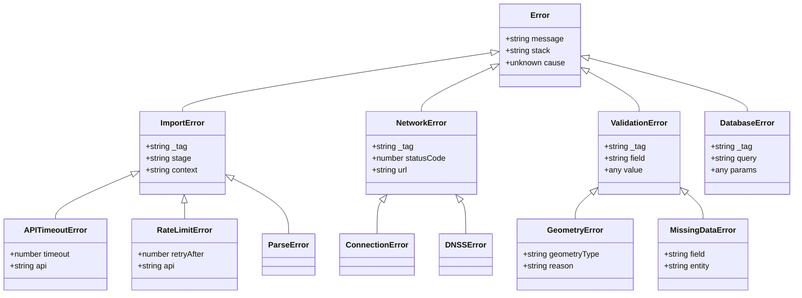

### Error Categories by Stage

```mermaid
graph TD
    ROOT[Import Pipeline Errors]

    ROOT --> STAGE1[Stage 1: OSM Fetch]
    ROOT --> STAGE2[Stage 2: Wikidata]
    ROOT --> STAGE3[Stage 3: Transform]
    ROOT --> STAGE4[Stage 4: Database]
    ROOT --> STAGE5[Stage 5: Verify]

    STAGE1 --> E1A[Network timeout]
    STAGE1 --> E1B[API rate limit]
    STAGE1 --> E1C[Invalid JSON]
    STAGE1 --> E1D[Empty response]

    STAGE2 --> E2A[Invalid Wikidata ID]
    STAGE2 --> E2B[Missing P373 property]
    STAGE2 --> E2C[Network error]
    STAGE2 --> E2D[Entity not found]

    STAGE3 --> E3A[Invalid geometry]
    STAGE3 --> E3B[Missing wikidata tag]
    STAGE3 --> E3C[Duplicate entry]
    STAGE3 --> E3D[Malformed data]

    STAGE4 --> E4A[Connection pool full]
    STAGE4 --> E4B[Transaction failed]
    STAGE4 --> E4C[Constraint violation]
    STAGE4 --> E4D[Insert timeout]

    STAGE5 --> E5A[Verification query failed]
    STAGE5 --> E5B[Unexpected counts]

```

## Retry Logic

### Retry Configuration

```mermaid
graph TB
    subgraph "Retry Constants"
        MAX[MAX_ATTEMPTS: 3]
        BASE[BASE_DELAY_MS: 1000]
        EXP[EXPONENTIAL_BASE: 2]
        MAX_D[MAX_DELAY_MS: 10000]
    end

    subgraph "Retry Formula"
        FORMULA[delay = BASE_DELAY_MS × EXPONENTIAL_BASE^(attempt-1)]
    end

    subgraph "Example Delays"
        D1[Attempt 1: 1000ms]
        D2[Attempt 2: 2000ms]
        D3[Attempt 3: 4000ms]
    end

    MAX --> FORMULA
    BASE --> FORMULA
    EXP --> FORMULA

    FORMULA --> D1
    FORMULA --> D2
    FORMULA --> D3

```

### Retry State Machine

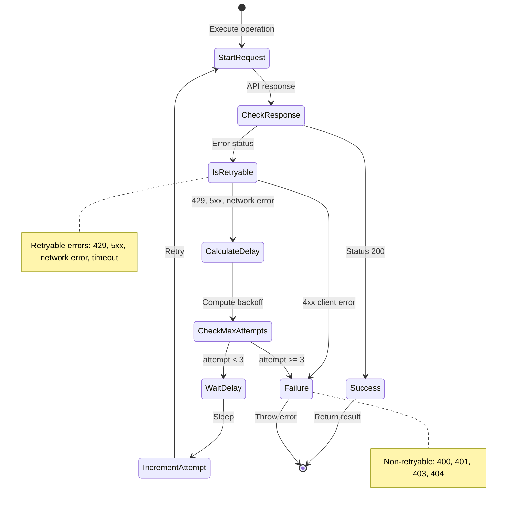

### Retry Flow Diagram

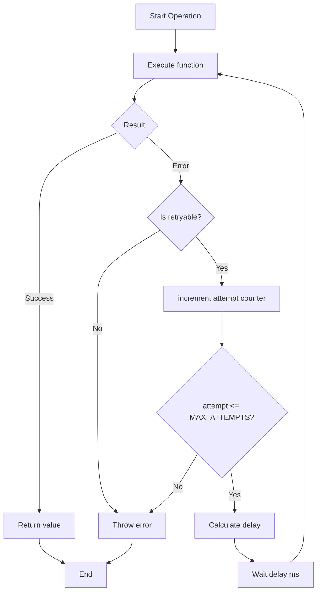

### Retry Implementation

```mermaid
sequenceDiagram
    participant Caller as Calling Code
    participant Retry as Retry Logic
    participant Func as Function to Retry
    participant API as External API

    Caller->>Retry: executeWithRetry(func)
    activate Retry
    Retry->>Retry: attempt = 1

    loop Max 3 attempts
        Retry->>Func: Call function
        activate Func
        Func->>API: Make request
        API-->>Func: Response
        Func-->>Retry: Result or Error
        deactivate Func

        alt Success
            Retry-->>Caller: Success result
            break Exit loop
            break
        else Error
            Retry->>Retry: Check if retryable
            alt Not retryable
                Retry-->>Caller: Throw error
                break Exit loop
                break
            else Retryable
                Retry->>Retry: Check attempt count
                alt attempt >= 3
                    Retry-->>Caller: Throw error (max retries)
                    break Exit loop
                    break
                else attempt < 3
                    Retry->>Retry: Calculate delay
                    Retry->>Retry: Wait (1000, 2000, 4000ms)
                    Retry->>Retry: increment attempt
                end
            end
        end
    end
    deactivate Retry
```

## Error Recovery Strategies

### Strategy Decision Tree

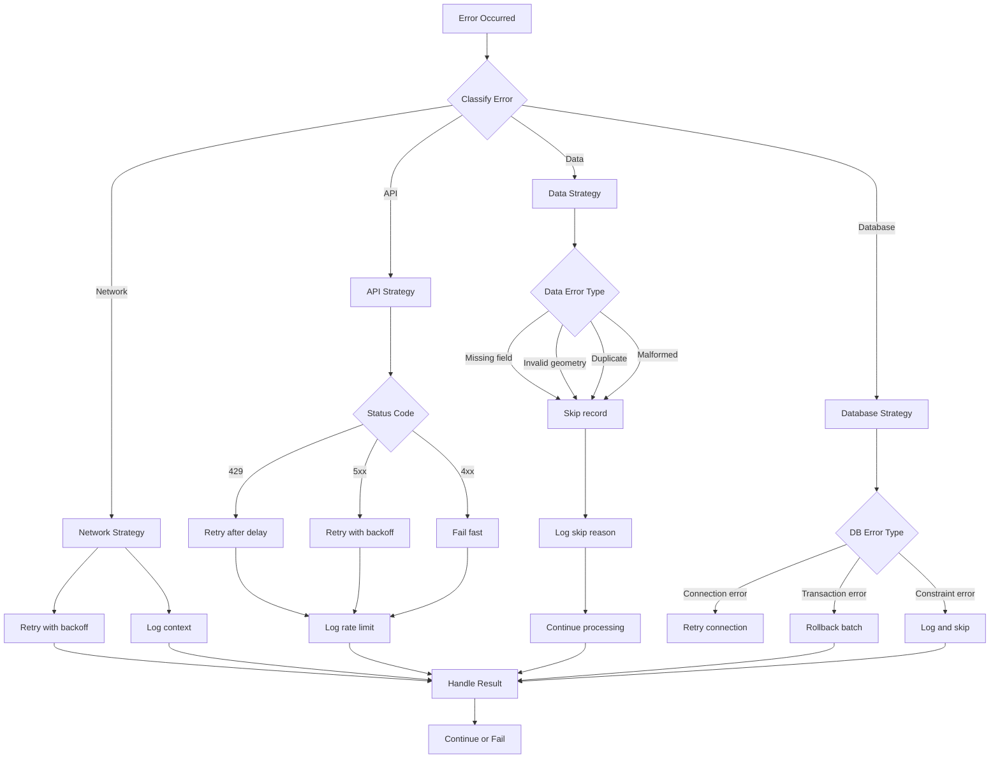

### Effect TS Error Handling

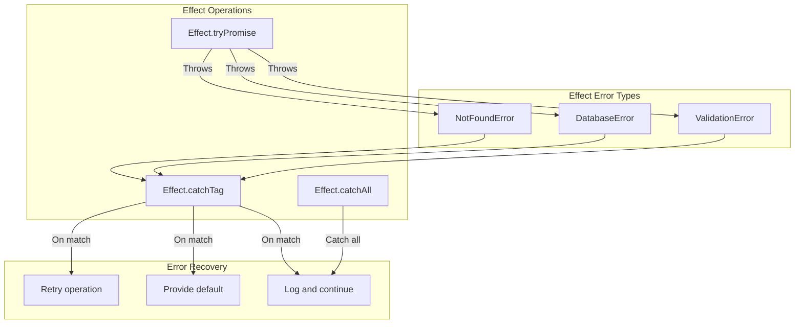

### Example: Database Error Recovery

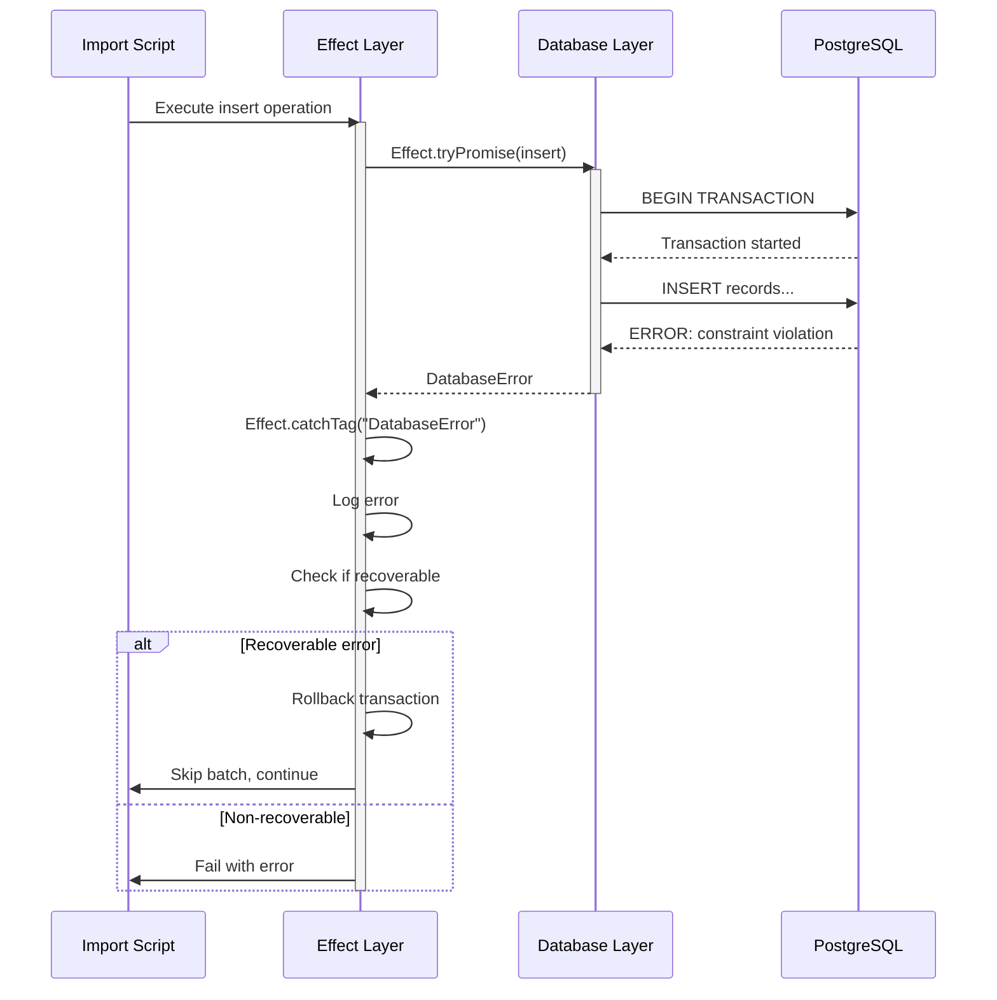

## Stage-Specific Error Handling

### Stage 1: OSM Fetch Errors

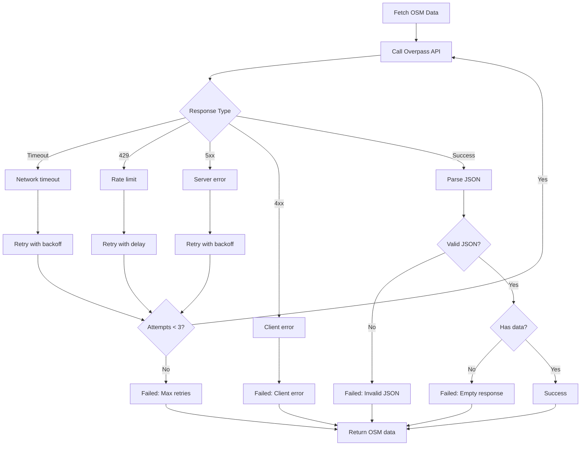

### Stage 2: Wikidata Errors

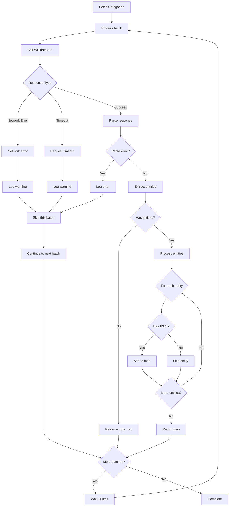

### Stage 3: Transform Errors

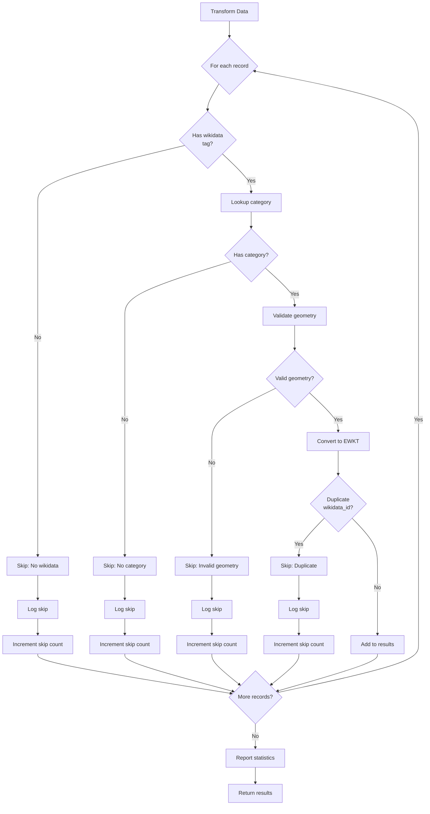

### Stage 4: Database Errors

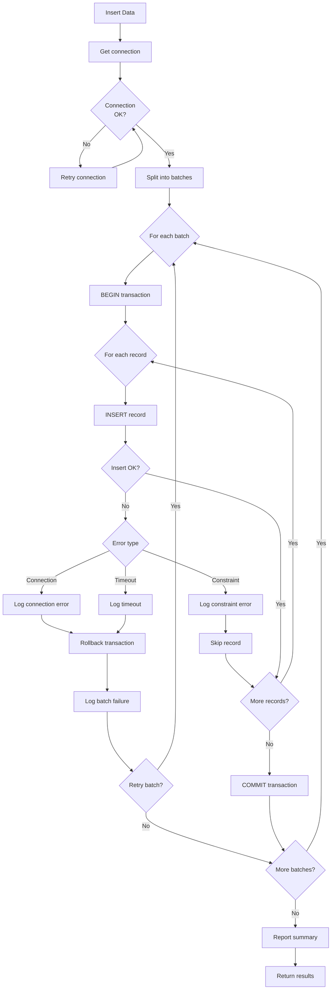

## Error Logging

### Log Levels

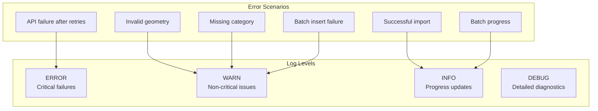

### Error Message Format

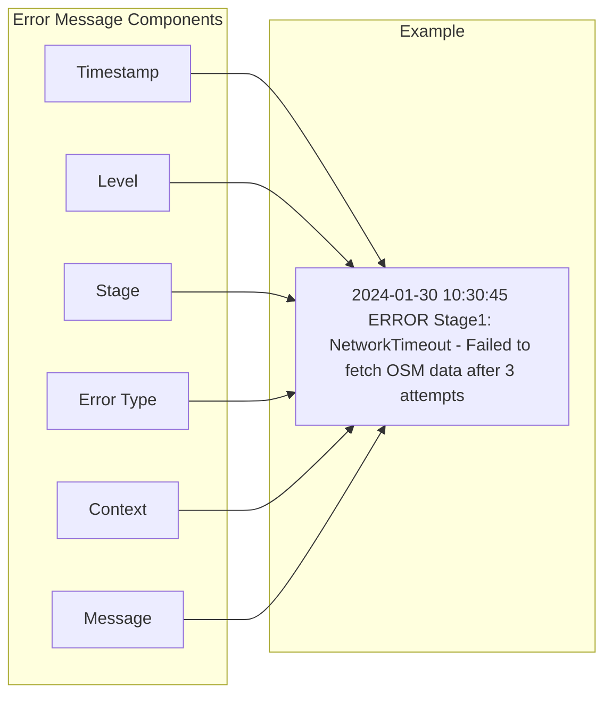

## Graceful Degradation

### Degradation Strategies

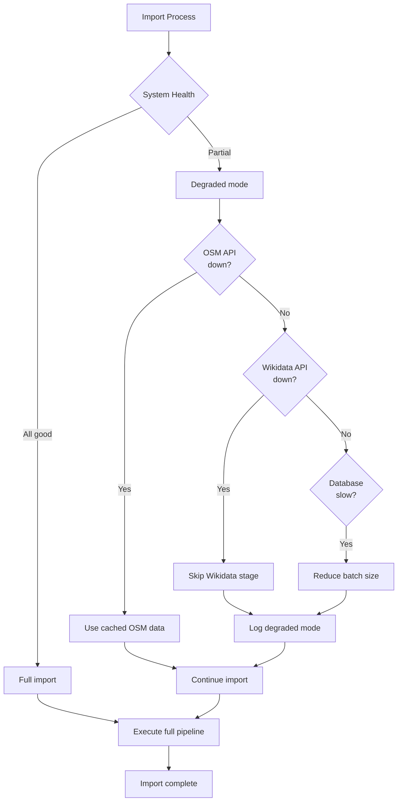

### Data Quality on Errors

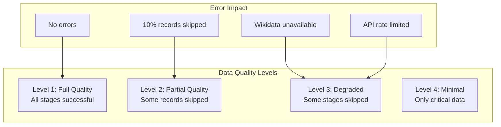

## Error Recovery Summary

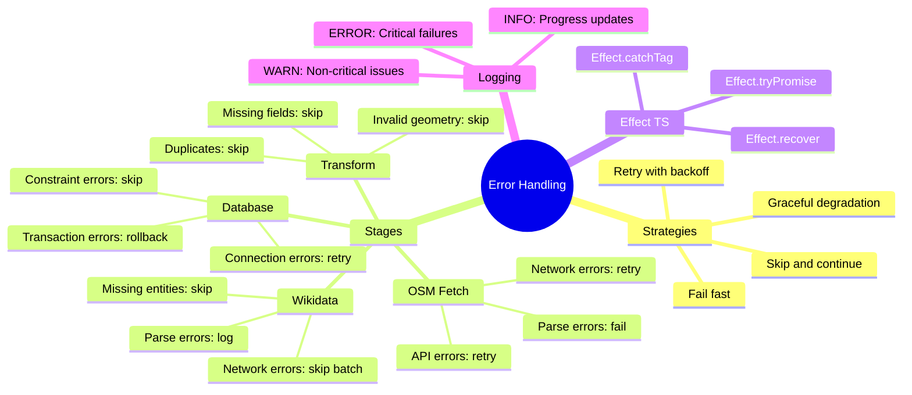
