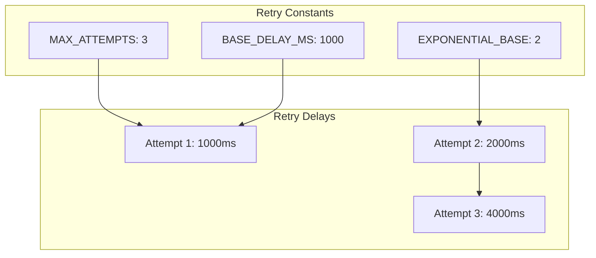
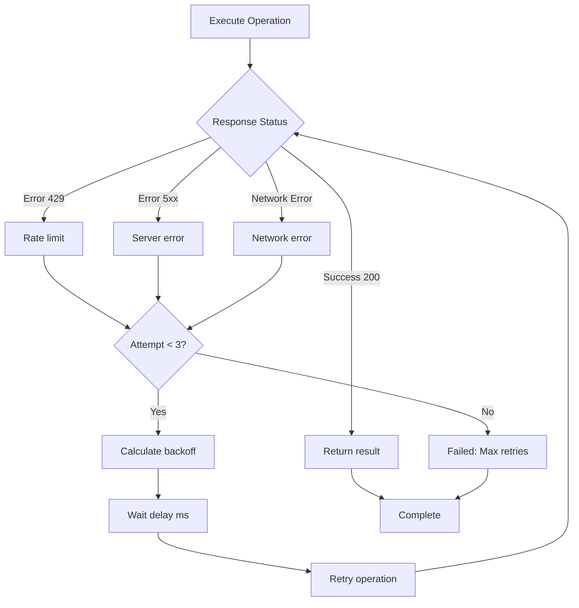
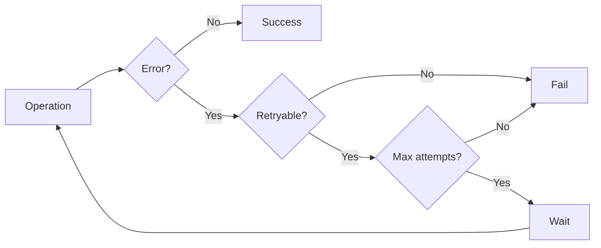
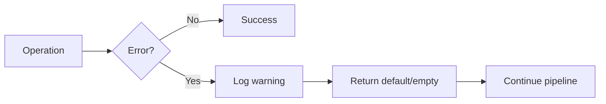
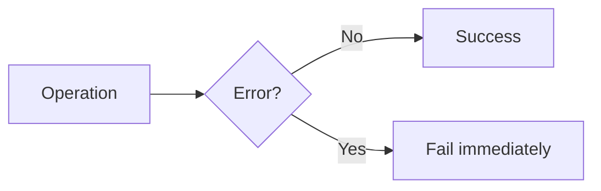

# Error Handling Documentation

Error handling patterns, retry logic, and failure recovery for the import pipeline.

## Retry Configuration



**Retry Formula:** `delay = BASE_DELAY_MS × EXPONENTIAL_BASE^(attempt-1)`

## Retry Logic Flow



## Effect TS Error Handling

### tryAsync Helper

```typescript
export const tryAsync = <T>(
  tryFn: () => Promise<T>,
  context?: string
): Effect.Effect<T, Error> => {
  return Effect.tryPromise({
    try: tryFn,
    catch: (error) => new Error(`${context}: ${error}`)
  })
}
```

## Stage-Specific Error Handling

### Stage 1: OSM Fetch Errors

| Error Type | Retryable | Handling |
|------------|-----------|----------|
| Network timeout | Yes | Retry with exponential backoff |
| 429 Rate limit | Yes | Retry with delay |
| 5xx Server error | Yes | Retry with backoff |
| 4xx Client error | No | Fail fast |
| Invalid JSON | No | Fail fast |

### Stage 2: Wikidata ID Extraction

| Error Type | Retryable | Handling |
|------------|-----------|----------|
| Database connection error | Yes | Retry connection |
| Query timeout | Yes | Retry query |
| Empty result | No | Return empty array (continue) |

### Stage 3: Wikidata API Errors

| Error Type | Retryable | Handling |
|------------|-----------|----------|
| Network error | No | Log warning, skip batch |
| Timeout | No | Log warning, skip batch |
| 429 Rate limit | Yes | Retry with delay |
| 5xx Server error | Yes | Retry with backoff |
| Invalid response | No | Log error, skip batch |

**Key Behavior:** Wikidata batch failures don't stop the pipeline - they log warnings and continue with remaining batches.

### Stage 4: Transform Errors

| Error Type | Handling |
|------------|----------|
| Missing wikidata_id | Skip record, log debug |
| No Commons category | Skip record, log debug |
| Invalid geometry | Skip record, log warning |
| Duplicate wikidata_id | Remove duplicate, log info |

**Key Behavior:** Transform stage gracefully skips invalid records rather than failing.

### Stage 5: Database Insert Errors

| Error Type | Handling |
|------------|----------|
| Connection pool full | Retry connection |
| Transaction failed | Rollback batch, log error |
| Constraint violation | Log error, continue with next batch |
| Insert timeout | Rollback, retry batch |

## Error Recovery Patterns

### Pattern 1: Retry with Backoff



**Used by:**
- Overpass API requests (relation discovery, geometry fetch)
- Wikidata API requests (batch entity fetch)
- Database connection attempts

### Pattern 2: Graceful Degradation



**Used by:**
- Wikidata batch failures (skip batch, continue with next)
- Transform validation failures (skip record, continue processing)
- Missing Commons categories (skip record, log debug)

### Pattern 3: Fail Fast



**Used by:**
- Missing required environment variables
- Invalid Wikidata ID format
- Database connection initialization failures

## Common Error Scenarios

### Scenario 1: Overpass API Timeout

```
Error: Overpass API error: 504 Gateway Timeout
```

**Resolution:**
- Retry with exponential backoff (max 3 attempts)
- If all retries fail: Reduce admin level range or import smaller country

### Scenario 2: Wikidata Batch Failure

```
Error processing batch 15: Failed to fetch batch: 429
Batch 15 complete: 0 categories fetched
```

**Resolution:**
- Log warning, skip batch, continue with remaining batches
- Final category map will have missing entries for this batch
- Import completes but some records may lack Commons categories

### Scenario 3: Invalid Geometry

```
Invalid polygon coordinates for: Paris
Invalid geometries: 5
```

**Resolution:**
- Skip records with invalid geometries
- Log warnings for each skipped record
- Import completes with fewer records

### Scenario 4: Database Transaction Failure

```
Error: Failed to commit transaction
Batch failed, rolling back
```

**Resolution:**
- Rollback current batch
- Log error
- Continue with next batch
- Import completes but some records may be missing

## Logging Levels

| Level | Usage |
|-------|-------|
| `console.error()` | Critical failures that stop the pipeline |
| `console.warn()` | Non-critical issues (batch failures, validation errors) |
| `console.log()` | Progress updates, statistics |
| `console.debug()` | Detailed diagnostics (disabled in production) |
