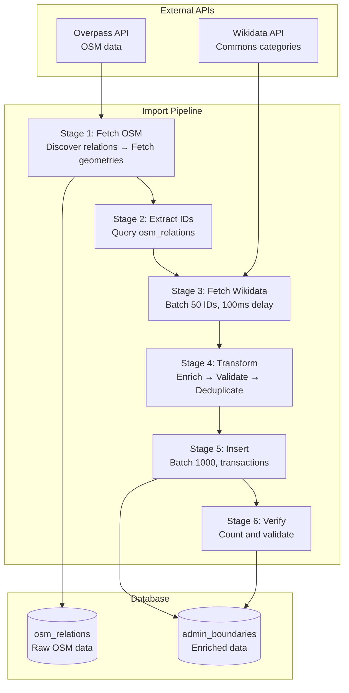
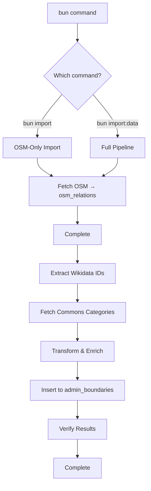
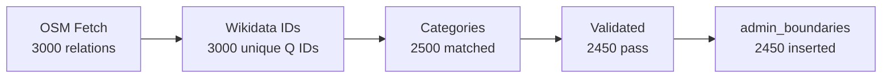
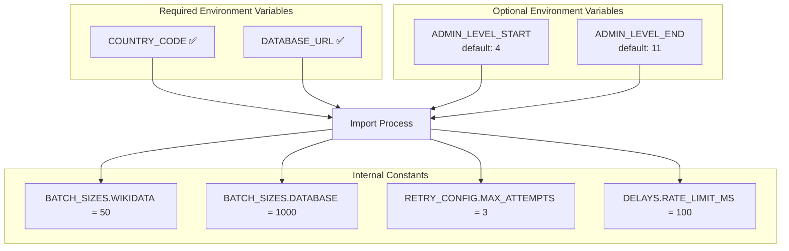
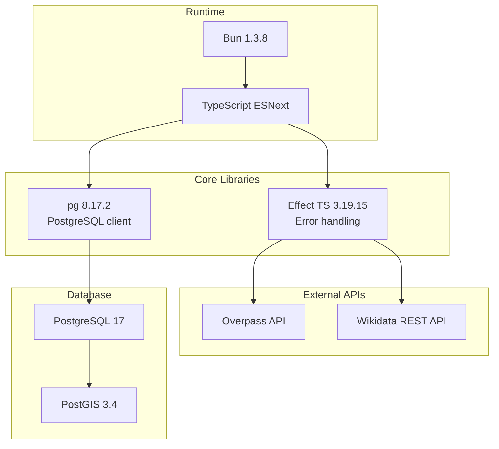
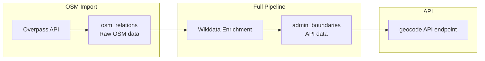

# Visual Overview

Visual diagrams and summaries of the import pipeline.

## Complete Import Pipeline

## Import Commands

## Data Flow Summary

**Typical Attrition:**
- OSM relations: 100%
- Wikidata matched: ~80%
- Validated: ~98%
- Final insert: ~75-80% of original

## Configuration Matrix

## Technology Stack

## Two-Table Architecture

## Key Characteristics

**Pipeline Features:**
- ✅ **Effect TS** for error-safe operations
- ✅ **Batch processing** (50 IDs for Wikidata, 1000 for DB)
- ✅ **Retry logic** (exponential backoff, max 3 attempts)
- ✅ **Graceful degradation** (continues on non-critical errors)
- ✅ **Transaction safety** (atomic batch commits)
- ✅ **Hierarchical discovery** (uses parent areas for child search)

**Implementation Details:**
- Overpass area IDs: `3600000000 + relationId`
- Wikidata ID format: Preserves "Q" prefix
- Geometry format: EWKT with SRID=4326
- Admin level skip: Uses `continue` not `break`

**For detailed information, see:**
- [Import Guide](./IMPORT_GUIDE.md) - Complete walkthrough
- [Architecture](./architecture.md) - System design
- [Data Flow](./data-flow.md) - Pipeline sequences
- [API Interactions](./api-interactions.md) - External APIs
- [Error Handling](./error-handling.md) - Retry logic
