# Visual Overview

Visual diagrams and summaries of the complete import pipeline.

## Complete Import Pipeline at a Glance

```mermaid
graph TB
    subgraph "🌍 External Data Sources"
        OSM_API[Overpass API<br/>OpenStreetMap]
        WD_API[Wikidata REST API<br/>Wikimedia]
    end

    subgraph "📥 Import Pipeline"
        STAGE1[Stage 1: Fetch OSM<br/>Overpass QL queries<br/>Retry with backoff]
        STAGE2[Stage 2: Fetch Wikidata<br/>Batch 50 IDs<br/>100ms delay]
        STAGE3[Stage 3: Transform<br/>Validate geometries<br/>Remove duplicates]
        STAGE4[Stage 4: Database<br/>Batch 1000 records<br/>Transaction safety]
        STAGE5[Stage 5: Verify<br/>Count records<br/>Check integrity]
    end

    subgraph "💾 Storage"
        CACHE["File Cache<br/>osm-country.json"]
        POSTGRES[(PostgreSQL<br/>PostGIS Extension)]
    end

    OSM_API --> STAGE1
    STAGE1 --> CACHE
    STAGE1 --> STAGE2
    WD_API --> STAGE2
    STAGE2 --> STAGE3
    STAGE3 --> STAGE4
    STAGE4 --> POSTGRES
    STAGE4 --> STAGE5
    STAGE5 --> POSTGRES

```

## Component Interaction Map

## Data Volume Flow

## Timing Diagram

## Error Recovery Flow

## Configuration Matrix

```mermaid
graph TB
    subgraph "Required Config"
        R1[COUNTRY_CODE ✅]
        R2[DATABASE_URL ✅]
    end

    subgraph "Optional Config"
        O1[ADMIN_LEVELS<br/>default: 4,6,8]
        O2[BATCH_SIZE<br/>default: 1000]
        O3[OUTPUT_DIR<br/>default: ./output]
        O4[SKIP_WIKIDATA<br/>default: false]
    end

    subgraph "Internal Config"
        I1[WIKIDATA_BATCH_SIZE<br/>fixed: 50]
        I2[RATE_LIMIT_MS<br/>fixed: 100]
        I3[MAX_RETRIES<br/>fixed: 3]
        I4[BASE_DELAY_MS<br/>fixed: 1000]
    end

    R1 --> VALID[Validation]
    R2 --> VALID
    O1 --> VALID
    VALID --> IMPORT[Import Process]

    IMPORT --> I1
    IMPORT --> I2
    IMPORT --> I3
    IMPORT --> I4

```

## Performance Characteristics

## Data Quality Metrics

## Key Metrics Dashboard

## Technology Stack

## Documentation Navigation

## Quick Reference Card

## Summary

The import system is a **four-stage pipeline** that:

1. **Fetches** administrative boundaries from OpenStreetMap via Overpass API
2. **Enriches** them with Wikimedia Commons categories via Wikidata
3. **Transforms and validates** data for database insertion
4. **Persists** to PostgreSQL with PostGIS spatial extension

Key characteristics:
- ✅ **Effect TS** for error-safe operations
- ✅ **Batch processing** for API efficiency (50 IDs) and database throughput (1000 records)
- ✅ **Retry logic** with exponential backoff (max 3 attempts)
- ✅ **Graceful degradation** - continues on non-critical errors
- ✅ **Transaction safety** - atomic batch commits
- ✅ **Data validation** - geometry checks, deduplication
- ✅ **Progress tracking** - detailed logging and statistics

For detailed information, see:
- [Architecture](./architecture.md) - System design and components
- [Data Flow](./data-flow.md) - Pipeline sequences and state transitions
- [API Interactions](./api-interactions.md) - External API integration
- [Error Handling](./error-handling.md) - Error recovery and retry logic
